PaaS_TA_Monitoring-v5.0.0
=======================

1. [개요](#1)
    * [문서 개요](#1.1)  
        * [목적](#1.1.1)
        * [범위](#1.1.2)
        * [참고자료](#1.1.3)
2. [PaaS-TA Monitoring Application 환경 설정](#2)
    * [개요](#2.1)
    * [개발환경 사전 설치 사항](#2.2)
	* [개발환경 구성](#2.3)
	    * [Back-End 환경설정 (Windows / Ubuntu)](#2.3.1)
	        * [git 설치](#2.3.1.1)
	        * [Intellij IDEA 설치](#2.3.1.2)
	        * [golang 설치](#2.3.1.3)
	        * [Intellij – GO Application 환경 설정](#2.3.1.4)
	        * [소스 다운로드](#2.3.1.5)
	        * [IaaS-PaaS-Monitoring Application 구성](#2.3.1.6)
	        * [Server Start](#2.3.1.7)	    
3. [PaaS-TA Monitoring Application 구성](#3)	    
    * [IaaS-PaaS-Monitoring](#3.1)
        * [관련 Table 목록 및 구조](#3.1.1)
            * [관련 Table 목록](#3.1.1.1)
            * [실시간 모니터링 기반 데이터 수집 정보](#3.1.1.2)
            * [구조](#3.1.1.3)
        * [Component 정보](#3.1.2)
        * [설정 정보](#3.1.3)
        * [API Package 구조](#3.1.4)
        * [API Package 간 호출 구조](#3.1.5)
        * [UI Package 구조](#3.1.6)
        * [UI Package 간 호출 구조](#3.1.7)
        * [화면](#3.1.8)
            * [Login](#3.1.8.1)
            * [Dashboard](#3.1.8.2)
            * [IaaS Main](#3.1.8.3)
            * [Manage Node Summary](#3.1.8.4)
            * [Manage Node Detail](#3.1.8.5)
            * [Compute Node Summary](#3.1.8.6)
            * [Compute Node Detail](#3.1.8.7)
            * [Tenant Summary](#3.1.8.8)
            * [Tenant Detail](#3.1.8.9)
            * [Alarm Notification](#3.1.8.10)
            * [Alarm Policy](#3.1.8.11)
            * [Alarm Policy Create](#3.1.8.12)
            * [Alarm Status](#3.1.8.13)
            * [Alarm Status Detail](#3.1.8.14)
            * [PaaS Main](#3.1.8.15)
            * [Bosh Summary](#3.1.8.16)
            * [Bosh Detail](#3.1.8.17)
            * [PaaS-TA Summary](#3.1.8.18)
            * [PaaS-TA Detail](#3.1.8.19)
            * [Container Summary](#3.1.8.20)
            * [Container Detail](#3.1.8.21)
            * [Alarm Policy](#3.1.8.22)
            * [Alarm Status](#3.1.8.23)
            * [Alarm Status Detail](#3.1.8.24)
            * [Alarm Statistics](#3.1.8.25)            
            * [CaaS Main](#3.1.8.26)
            * [CaaS Cluster](#3.1.8.27)
            * [CaaS Cluster Detail](#3.1.8.28)
            * [CaaS WorkLoads](#3.1.8.29)
            * [CaaS WorkLoads Detail](#3.1.8.30)
            * [CaaS Pod](#3.1.8.31)
            * [CaaS Pod Detail](#3.1.8.32)
            * [CaaS Container Log](#3.1.8.33)
            * [CaaS Alarm Policy](#3.1.8.34)
            * [CaaS Alarm Status](#3.1.8.35)
            * [CaaS Alarm Status Detail](#3.1.8.36)
            * [SaaS Main](#3.1.8.37)
            * [SaaS PINPOINT](#3.1.8.38)
            * [SaaS Alarm Policy](#3.1.8.39)
            * [SaaS Alarm Status](#3.1.8.40)
            * [CaaS SaaS Status Detail](#3.1.8.41)
            
            
    * [PaaS-TA Monitoring Batch](#3.2)
        * [관련 Table 목록 및 구조](#3.2.1)
        * [Component 정보](#3.2.2)
        * [설정 정보](#3.2.3)
        * [Package 구조](#3.2.4)
        * [Package 간 호출 구조](#3.2.5)
        * [Alarm Message](#3.2.6)
            * [e-mail](#3.2.6.1)
            * [telegram](#3.2.6.2)    
            
            
    * [CaaS Monitoring Batch](#3.3)
        * [관련 Table 목록 및 구조](#3.3.1)
        * [Component 정보](#3.3.2)
        * [설정 정보](#3.3.3)
        * [Package 구조](#3.3.4)
        * [Package 간 호출 구조](#3.3.5)
        * [Alarm Message](#3.3.6)
        * [e-mail](#3.3.6.1)
        * [telegram](#3.3.6.2)
                
                                                
    * [SaaS Monitoring Batch](#3.4)
        * [관련 Table 목록 및 구조](#3.4.1)
        * [Component 정보](#3.4.2)
        * [설정 정보](#3.4.3)
        * [Package 구조](#3.4.4)
        * [Package 간 호출 구조](#3.4.5)
        * [Alarm Message](#3.4.6)
        * [e-mail](#3.4.6.1)
        * [telegram](#3.4.6.2)                    
    * [Monitoring Guide Agent 구성](#3.5)
        * [개요](#3.5.1)
        * [PaaS Metrics Agent 개발환경 구성](#3.5.2)
            * [bosh-metrics-agent 개요](#3.5.2.1)
            * [bosh-metrics-agent 개발환경 구성](#3.5.2.2)
            * [bosh-metrics-agent release 구성](#3.5.2.3)
<br /><br /><br />

#   1. 개요 <div id='1' />

##  1.1. 문서개요 <div id='1.1' />

<br />

### 1.1.1. 목적 <div id='1.1.1' />

> 본 문서는 Paas-TA 프로젝트의 IaaS, PaaS, CaaS, SaaS Monitoring 애플리케이션을 개발 및 배포하는 방법에 대해 제시하는 문서이다.

<br />

###  1.1.2. 범위 <div id='1.1.2' />

> 본 문서의 범위는 IaaS, PaaS, CaaS, SaaS 시스템 상태를 조회하고, 임계치 정보와의 비교를 통해 관리자에게 관련 정보를 전달하는 방법에 대한 내용으로 한정되어 있다.

<br />

### 1.1.3. 참고자료 <div id='1.1.3' />
- https://golang.org/
- https://git-scm.com
- github.com/tedsuo/ifrit
- github.com/tedsuo/rata
- github.com/influxdata/influxdb1-client/v2
- github.com/rackspace/gophercloud
- github.com/cloudfoundry-community/go-cfclient
- github.com/go-redis/redis
- github.com/go-sql-driver/mysql
- github.com/jinzhu/gorm
- github.com/cihub/seelog
- github.com/monasca/golang-monascaclient/monascaclient
- github.com/gophercloud/gophercloud/
- github.com/alexedwards/scs
- gopkg.in/olivere/elastic.v3
- github.com/onsi/ginkgo
- github.com/onsi/gomega
- github.com/stretchr/testify
- github.com/cloudfoundry-community/gogobosh
- github.com/go-telegram-bot-api/telegram-bot-api
- github.com/thoas/go-funk
- get github.com/tidwall/gjson
- gopkg.in/gomail.v2
<br /><br /><br />

#   2. PaaS-TA Monitoring Application 환경 설정 <div id='2' />

##  2.1. 개요 <div id='2.1' />

> 클라우드 서비스(IaaS/PaaS/CaaS/SaaS) 통합 운영관리 기술 개발 프로젝트의 IaaS-PaaS-Monitoring 시스템에서 IaaS(Openstack)시스템의 상태와 PaaS-Ta 서비스(Bosh/CF/Diego/App)들의 상태를 조회하여 사전에 설정한 임계치 값과 비교 후, 초과된 시스템 자원을 사용중인 서비스들의 목록을 관리자에게 통보하기 위한 애플리케이션 개발하고, 배포하는 방법을 설명한다.
<br />

##  2.2. 개발환경 사전 설치 사항 <div id='2.2' />
IaaS-PaaS-Monitoring 시스템에는 선행작업(Prerequisites)으로 Monasca Server 및 Monasca Client가 설치되어 있어야 합니다.
> **[Monasca - Server](./Monasca_Server.md)**

> **[Monasca - Client](./Monasca_Client.md)**

##  2.3. 개발환경 구성 <div id='2.3' />

> 애플리케이션 개발을 위해 다음과 같은 환경으로 개발환경을 구성 한다.
```
- OS : Window/Ubuntu
- Golang : 1.12.6
- Dependencies :  github.com/tedsuo/ifrit
                  github.com/tedsuo/rata
                  github.com/influxdata/influxdb/client/v2
                  github.com/rackspace/gophercloud
                  github.com/cloudfoundry-community/go-cfclient
                  github.com/go-redis/redis
                  github.com/go-sql-driver/mysql
                  github.com/jinzhu/gorm
                  github.com/cihub/seelog
                  github.com/monasca/golang-monascaclient/monascaclient
                  github.com/gophercloud/gophercloud/
                  github.com/alexedwards/scs
                  gopkg.in/olivere/elastic.v3
                  github.com/onsi/ginkgo
                  github.com/onsi/gomega
                  github.com/stretchr/testify
                  github.com/cloudfoundry-community/gogobosh
                  github.com/go-telegram-bot-api/telegram-bot-api
- IDE : Intellij IDEA 2019.
- 형상관리: Git
```
※ Intellij IDEA 는 Commnuity와 Ultimate 버전이 있는데, Community 버전은 Free이고, Ultimate 버전은 은 30-day trial버전이다. Community는 Version 2019.2 이하에서 환경 구성이 가능하다.

<br/>

### 2.3.1. Back-End 환경설정 (Windows / Ubuntu) <div id='2.3.1' />

> **git 설치** <div id='2.3.1.1' />

- 아래 URL에서 자신에 OS에 맞는 Git client를 다운로드 받아 설치 한다.
    + https://git-scm.com/downloads


> **IntelliJ IDEA설치** <div id='2.3.1.2' />

- *IDEA 다운로드 URL*
    + https://www.jetbrains.com/idea/?fromMenu
    
    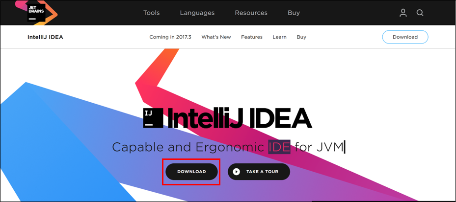<br/>
    <br/>

- *IntelliJ IDEA 다운로드(Windows)*
    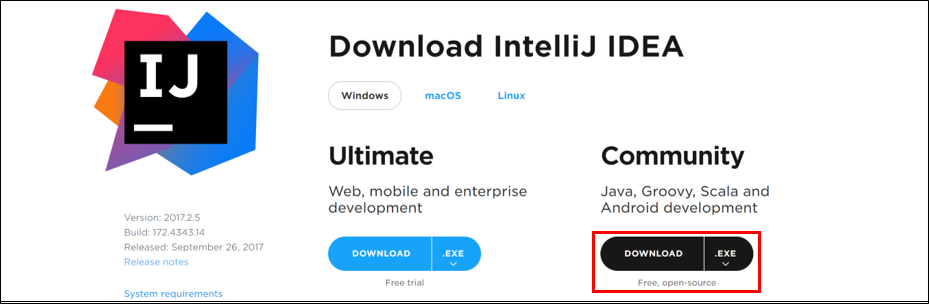<br/>
    <br/>
    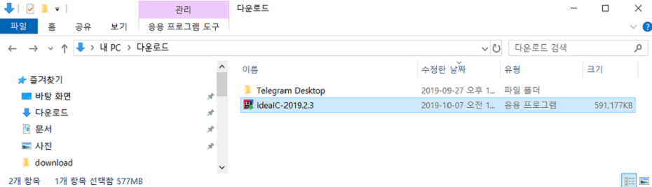<br/>
    <br/>

- *IntelliJ IDEA 다운로드(Ubuntu)*
    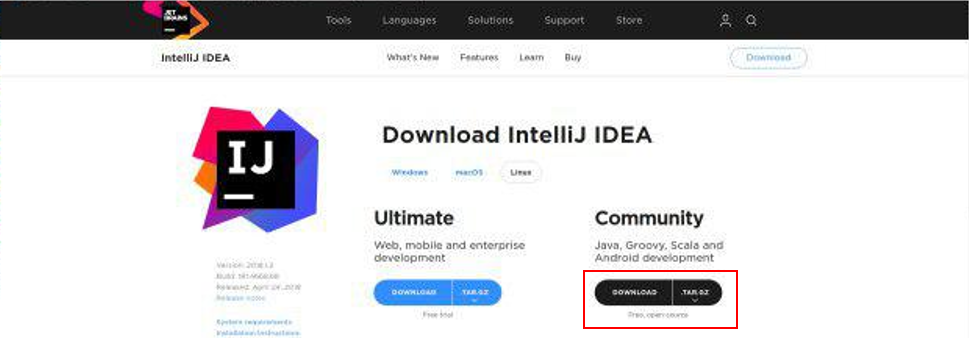<br/>
    <br/>
    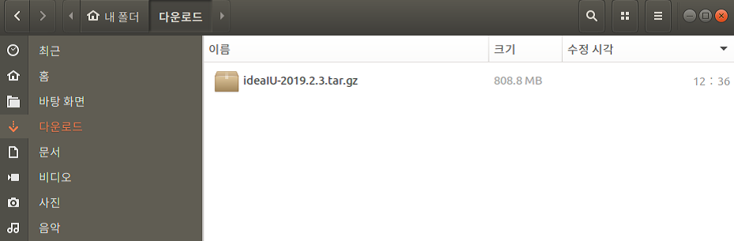<br/>
    <br/><br/>

- *Intellij IDEA 설치(Windows)*
    
    idealC-2019.2.3.exe 더블클릭하여 설치를 실행한다.<br/>
    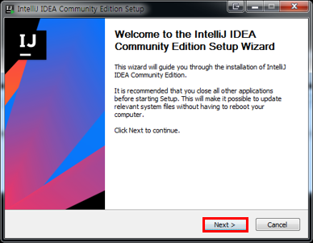<br/>
    
    'Next' 버튼 클릭<br/>
    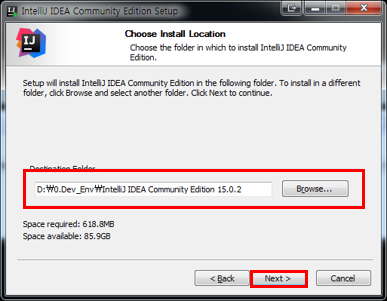<br/>
    
    설치위치 지정 후 'Next' 버튼 클릭<br/>
    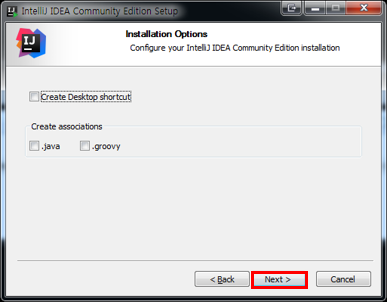<br/>
    
    'Next' 버튼 클릭<br/>
    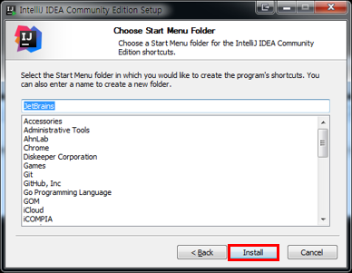<br/>
    
    'Install' 버튼 클릭<br/>
    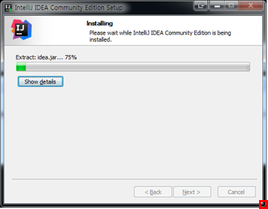<br/>
    
    Run IntelliJ IDEA Community Edition” 체크 선택<br/>
    'Finish' 버튼 클릭<br/>
    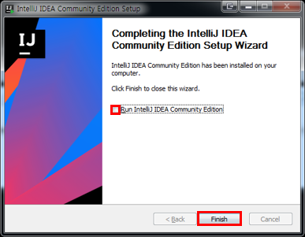<br/>
    <br/><br/>

- *Intellij IDEA 설치(Ubuntu)*
```
cd download
sudo tar xvzf ideaIC-2019.2.3.tar.gz
```

<br/><br/>

> **Go Lang 설치** <div id='2.3.1.3' />

- 아래 URL에서 자신에 OS에 맞는 go SDK를 다운로드 받아 설치 한다. (1.8 이상)

    + https://golang.org/dl

    
- GOROOT, 및 PATH를 설정한다.

<br/><br/>

> **Intellij – GO Application 환경 설정** <div id='2.3.1.4' />

- 만약, Go SDK 설정이 되어 있지 않을 경우, 아래 절차를 통해 SDK를 등록한다.
<br/>화면상단 메뉴에서 File > Setting 을 클릭한다.<br/>
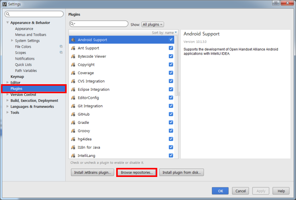<br/>

- 왼쪽 메뉴에서 "Plugin"을 선택 후, "Browse repositories" 버튼을 클릭한다.<br/>
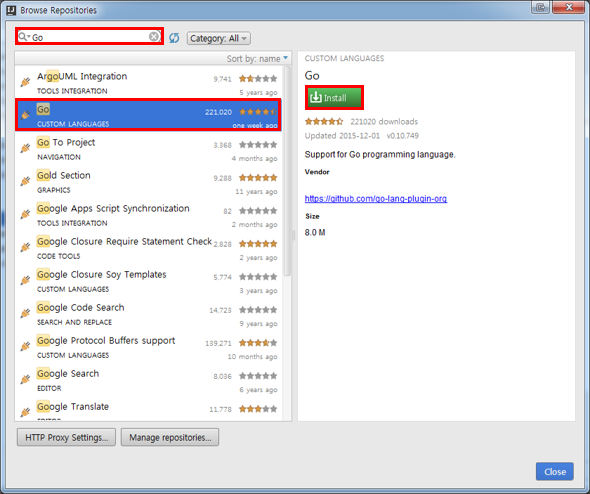<br/>

- 검색어 입력란에 "Go"  입력 후, 조회된 결과에서 "Go"를 선택한 뒤, "Install" 버튼을 클릭한다.<br/>
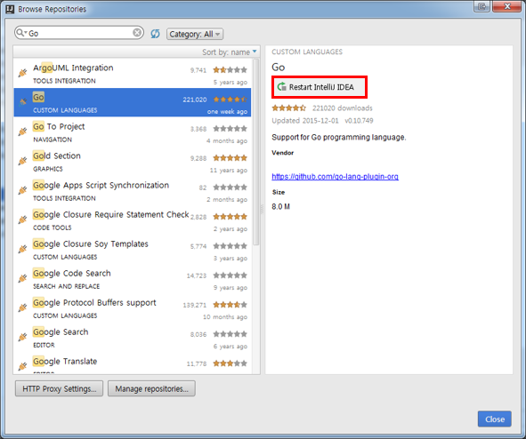<br/>

- "Restart IntelliJ IDEA" 선택<br/>
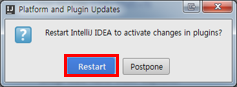<br/>

<br/><br/>

> **소스 다운로드** <div id='2.3.1.5' />

- PaaS-TA 소스를 다운로드 받는다.
```    
$ cd workspace
$ git clone https://github.com/PaaS-TA/PaaS-TA-Monitoring
```
<br/><br/>

> **IaaS-PaaS-Monitoring Application 구성** <div id='2.3.1.6' />

- Project 열기

    - IntellJ 실행 후 "Open" 을 선택한다.<br/>
    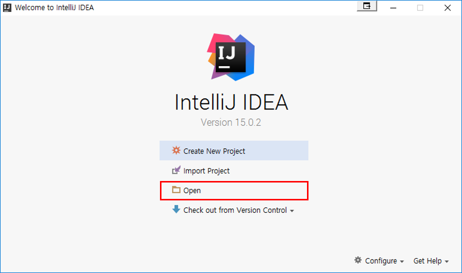<br/>

    - 화면상단 메뉴에서 File > Open 을 클릭한다.<br/>
    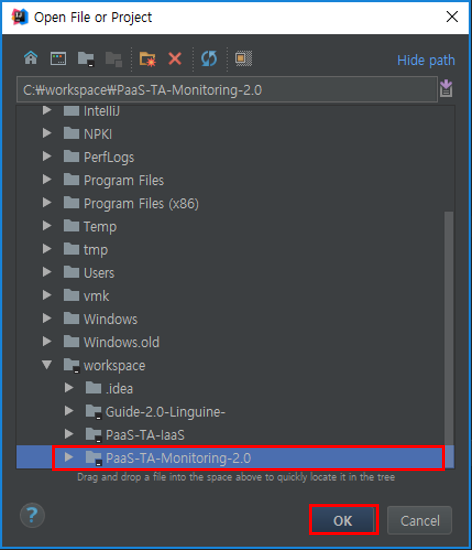<br/>

    <br/>
    
- GOROOT / GOPATH 설정

    - "Languages & Frameworks" 를 클릭 후 "Go"를 클릭한다.<br/>
    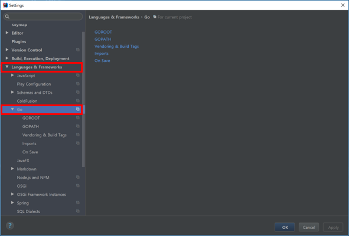<br/>

    - "GOROOT" 를 클릭한다. SDK를 아래와 같이 선택한다.<br/>
    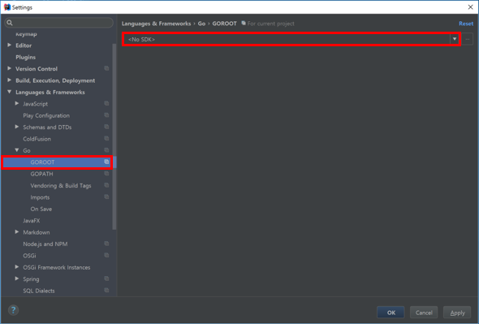<br/>

    - 앞서 설치된 “Go”를 선택한다.<br/>
    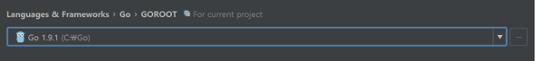<br/>
 
    - Global GOPATH 우측 + 버튼을 클릭하여 "C:\Go\bin" 설정한다.<br/> 
    - Project GOPATH 우측 + 버튼을 클릭하여 "\…\PaaS-Monitoring\src\paasta-monitoring-batch" 로 설정한다.<br/>
    - Project GOPATH 우측 + 버튼을 클릭하여 "\…\PaaS-Monitoring\src\paasta-monitoring-management" 로 설정한다.<br/>
    - IntellJ 를 재시작한다.<br/>
    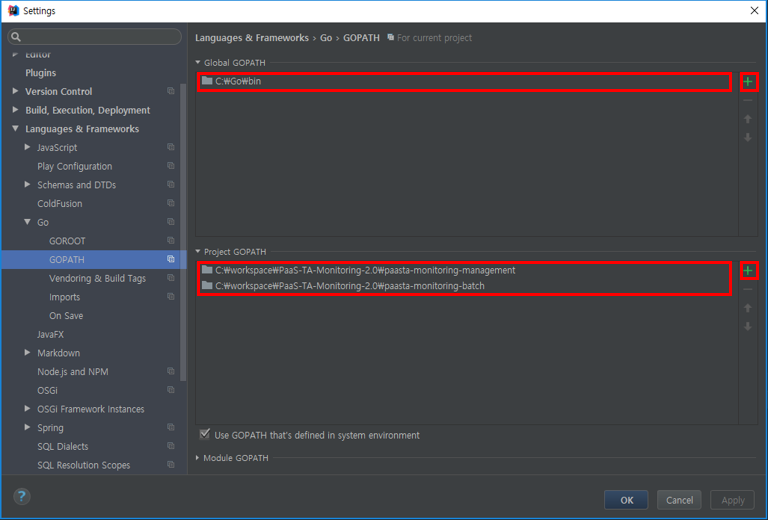

<br/><br/>

- Dependencies Module 다운로드 

    - iaas-paasta-monitoring-management Dependency Module Download

        Power Shell 또는 Terminal 을 실행한다.

        - Path 설정 (Windows)<br/>
        ```
        cd .\PaaS-TA-Monitoring\ iaas-paasta-monitoring-management
        set GOPATH='현재 디렉토리 경로"
        set PATH=%PATH%;%GOPATH%bin;
        ```
        <br/>

        - Path 설정 (Ubuntu)<br/>
        ```
        cd ./PaaS-TA-Monitoring/iaas-paasta-monitoring-management 
        export GOPATH=$PWD
        export PATH=$GOPATH/bin:$PATH
        ```
        <br/>

        - Power Shall 또는 Terminal 에 아래와 같이 실행한다. (공통)<br/>
        ```
        go get github.com/tedsuo/ifrit
        go get github.com/tedsuo/rata
        go get github.com/influxdata/influxdb1-client/v2
        go get github.com/rackspace/gophercloud
        go get github.com/go-redis/redis
        go get github.com/go-sql-driver/mysql
        go get github.com/jinzhu/gorm
        go get github.com/cihub/seelog
        go get github.com/monasca/golang-monascaclient/monascaclient
        go get github.com/gophercloud/gophercloud/
        go get github.com/alexedwards/scs
        go get gopkg.in/olivere/elastic.v3
        go get github.com/onsi/ginkgo
        go get github.com/onsi/gomega
        go get github.com/stretchr/testify
        go get github.com/cloudfoundry-community/gogobosh
        go get github.com/thoas/go-funk
        go get github.com/tidwall/gjson
        ```
        <br/>
    
        - src 디렉토리에 Dependency 소스들이 다운로드 되어 있음을 확인한다.<br/>
        <br/>
        <br/>
        
        - Dependency 소스 수정 (Windows)<br/>
        ```
        xcopy ./lib-bugFix-src/alarm_definitions.go ./src/github.com/monasca/golang-monascaclient/monascaclient
        xcopy ./lib-bugFix-src/notifications.go ./src/github.com/monasca/golang-monascaclient/monascaclient
        xcopy ./lib-bugFix-src/alarms.go ./src/github.com/monasca/golang-monascaclient/monascaclient
        xcopy ./lib-bugFix-src/monascaclient/client.go ./src/github.com/monasca/golang-monascaclient/monascaclient
        xcopy ./lib-bugFix-src/gophercloud/requests.go ./src/github.com/rackspace/gophercloud/openstack/identity/v3/tokens
        xcopy ./lib-bugFix-src/gophercloud/results.go ./src/github.com/rackspace/gophercloud/openstack/identity/v3/tokens
        xcopy ./lib-bugFix-src/gophercloud/client.go ./src/github.com/rackspace/gophercloud/openstack
        ```
        <br/>

        - Dependency 소스 수정 (Ubuntu)<br/>
        ```
        cp ./lib-bugFix-src/alarm_definitions.go ./src/github.com/monasca/golang-monascaclient/monascaclient
        cp ./lib-bugFix-src/notifications.go ./src/github.com/monasca/golang-monascaclient/monascaclient
        cp ./lib-bugFix-src/alarms.go ./src/github.com/monasca/golang-monascaclient/monascaclient
        cp ./lib-bugFix-src/monascaclient/client.go ./src/github.com/monasca/golang-monascaclient/monascaclient
        cp ./lib-bugFix-src/gophercloud/requests.go ./src/github.com/rackspace/gophercloud/openstack/identity/v3/tokens
        cp ./lib-bugFix-src/gophercloud/results.go ./src/github.com/rackspace/gophercloud/openstack/identity/v3/tokens
        cp ./lib-bugFix-src/gophercloud/client.go ./src/github.com/rackspace/gophercloud/openstack
        ```
        
        <br/><br/>
        
    - paasta-monitoring-batch Dependency Module Download
    
        Power Shall 또는 Terminal 을 실행한다.
    
        - Path 설정 (Windows)<br/>
        ```
        cd \...\IaaS-PaaS-Monitoring\src\paasta-monitoring-batch
        set GOPATH='현재 디렉토리 경로"
        set PATH=%PATH%;%GOPATH%bin;
        ```
        <br/>
    
        - Path 설정 (Ubuntu)<br/>
        ```
        cd .../IaaS-PaaS-Monitoring/src/paasta-monitoring-batch
        export GOPATH=$PWD
        export PATH=$GOPATH/bin:$PATH
        ```
        <br/>
            
        - Power Shall 또는 Terminal 에 아래와 같이 실행한다. (공통)<br/>
        ```
        go get github.com/tedsuo/ifrit
        go get github.com/go-sql-driver/mysql
        go get github.com/jinzhu/gorm
        go get github.com/influxdata/influxdb1-client/v2
        go get github.com/cloudfoundry-community/gogobosh
        go get golang.org/x/oauth2
        go get golang.org/x/net/context
        go get github.com/onsi/ginkgo
        go get github.com/onsi/gomega
        go get github.com/tools/godep
        go get golang.org/x/sys/unix
        go get github.com/go-telegram-bot-api/telegram-bot-api
        go get github.com/go-redis/redis
        ```
        <br/>        
    
        - src 디렉토리에 Dependency 소스들이 다운로드 되어 있음을 확인한다.<br/>
        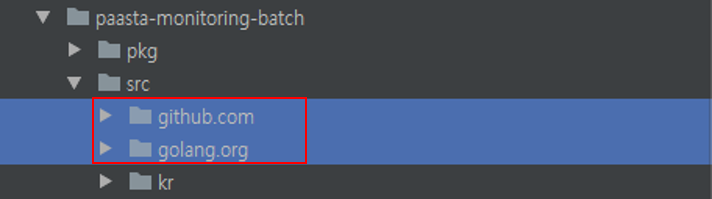<br/>
        
        <br/><br/>

    - paasta-caas-monitoring-batch Dependency Module Download
    
        Power Shall 또는 Terminal 을 실행한다.
    
        - Path 설정 (Windows)<br/>
        ```
        cd \...\IaaS-PaaS-Monitoring\src\paasta-caas-monitoring-batch
        set GOPATH='현재 디렉토리 경로"
        set PATH=%PATH%;%GOPATH%bin;
        ```
        <br/>
    
        - Path 설정 (Ubuntu)<br/>
        ```
        cd .../IaaS-PaaS-Monitoring/src/paasta-caas-monitoring-batch
        export GOPATH=$PWD
        export PATH=$GOPATH/bin:$PATH
        ```
        <br/>
            
        - Power Shall 또는 Terminal 에 아래와 같이 실행한다. (공통)<br/>
        ```
        go get github.com/go-sql-driver/mysql
        go get github.com/jinzhu/gorm
        go get github.com/mileusna/crontab
        go get github.com/thoas/go-funk
        go get github.com/tidwall/gjson
        go get gopkg.in/gomail.v2
        go get github.com/go-telegram-bot-api/telegram-bot-api
        ```
        <br/>        
    
        - src 디렉토리에 Dependency 소스들이 다운로드 되어 있음을 확인한다.<br/>
        <br/>
        
        <br/><br/>

    - paasta-saas-monitoring-batch Dependency Module Download
    
        Power Shall 또는 Terminal 을 실행한다.
    
        - Path 설정 (Windows)<br/>
        ```
        cd \...\IaaS-PaaS-Monitoring\src\paasta-saas-monitoring-batch
        set GOPATH='현재 디렉토리 경로"
        set PATH=%PATH%;%GOPATH%bin;
        ```
        <br/>
    
        - Path 설정 (Ubuntu)<br/>
        ```
        cd .../IaaS-PaaS-Monitoring/src/paasta-saas-monitoring-batch
        export GOPATH=$PWD
        export PATH=$GOPATH/bin:$PATH
        ```
        <br/>
            
        - Power Shall 또는 Terminal 에 아래와 같이 실행한다. (공통)<br/>
        ```
        go get github.com/go-sql-driver/mysql
        go get github.com/jinzhu/gorm
        go get github.com/mileusna/crontab
        go get github.com/thoas/go-funk
        go get github.com/tidwall/gjson
        go get gopkg.in/gomail.v2
        go get github.com/go-telegram-bot-api/telegram-bot-api
        ```
        <br/>        
    
        - src 디렉토리에 Dependency 소스들이 다운로드 되어 있음을 확인한다.<br/>
        <br/>
        
        <br/><br/>

> **Server Start** <div id='2.3.1.7' />
    
- Windows
```
cd \...\IaaS-Monitoring\src\paasta-monitoring-management\src\kr\paasta\monitoring
go run main.go
```
<br/>
    
- Ubuntu
```
cd /.../IaaS-PaaS-Monitoring/src/paasta-monitoring-management/src/kr/paasta/monitoring
go run main.go
```
<br/>

# 3. Paas-TA Monitoring Application 구성 <div id='3' />
Paas-Ta Monitoring Application의 IaaS는 Openstack과 Monasca를 기반으로 구성되어 있다. Openstack Node에 monasca Agent가 설치되어 Metric Data를 Monasca에 전송해준다. IaaS 모니터링은 Openstack, Monasca와 연동하여 Application을 기동한다. 
&nbsp;&nbsp;&nbsp; 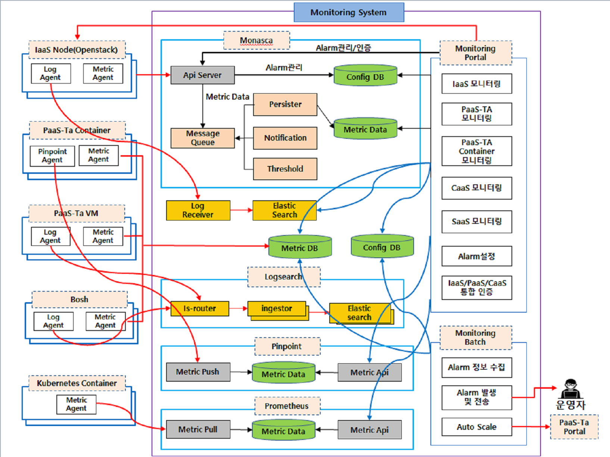
그림 1. PaaS-TA Monitoring 구성도

## 3.1. Paas-Ta Monitoring <div id='3.1' />

### 3.1.1. 관련 Table 목록 및 구조 <div id='3.1.1' />
Paas-Ta Monitoring은 기본적으로 Monasca의 Database 인 ‘mom‘ Database를 생성하여 사용한다. ‘PasstaMonitoring’ Database는 Server 실행시  Table을 자동으로 생성한다. PasstaMonitoring Database는 생성 후 config 파일에 설정한다.

> **관련 Table 목록** <div id='3.1.1.1' />

\<IaaS Monitoring Database\>

|Table명|설명|
|:--------|:--------|
|alarms|Alarm_definition 과 notification_method의 매핑 Table로 Alarm 발생시 Action 을 정의 한다.|
|alarm_definition|Alarm 임계치를 정의 한다. Expression 은 sub_alarm_definition에 저장된다.|
|alarm_definition_serverity|Alarm 심각도를 정의하는 table로 초기 Data (CRITICAL,HIGH,LOW,MEDIUM) 가 있다.|
|sub_alarm_definition|Alarm_definition에서 expression에 조건 만큼 Data존재한다.|
|sub_alarm_definition_dimension|Sub Alarm의 조회 field를 정의한다.|
|alarm_metric|Alarm metric정보가 저장된다.|
|alarm_state|Alarm state를 정의하는 table로 초기 Data(ALARM, OK, UNDETERMINED) 가 있다.|
|metric_definition|metric정의|
|metric_definition_dimensions|Metric measurement의 field정의가 있다.|
|notification_method|alarm 대상별 Alarm전송방식정보가 저장되어 있다.|
|notification_method_type|Alarm을 알릴 방식을 정의한다. Email, webhook등이 있다.|
|alarm|ThresholdEngine에서 alarm_definition에서 정의한 임계치 위배시 alarm 발생|
|sub_alarm|Alarm 발생시 alarm_definition에서 어떤 expression에서 임계치가 위배 되었는지 정보가 있다. ThresholdEngine에서 생성|
|alarm_action_histories|알람 조치 내역을 입력한다. IaaS Monitoring 에서 Table을 생성하고 관리한다.|

<br/>

\<PaaS Monitoring Database\>

|Table명|설명|
|:--------|:--------|
|alarm_actions|Alarm 메시지를 전송 받은 관리자가 알람 접수 후 해결 과정을 기술한다. (이슈관리)|
|alarm_policies|Alarm 임계치 정보를 설정한다.|
|alarm_sns|Alarm 발생시 전송 받을 채널(Telegram)을 정의한다.|
|alarm_sns_targets|Alarm 발생시 전송 받을 Telegram 사용자 넘버|
|alarm_targets|Alarm 발생시 전송받을 채널(EMAIL)을 정의한다.|
|alarms|발생된 알람 정보|
|app_alarm_histories|Application 알람 이력|
|app_alarm_policies|Application 알람 정책|
|ap_auto_scaling_policies|Application 오토스케일 정책|
|member_infos|회원정보|
|vms|PaaS-TA VM 정보|
|zones|PaaS-TA Zone 정보|

<br/>

\<CaaS SaaS Monitoring Database\>

|Table명|설명|
|:--------|:--------|
|batch_alarm_infos|Alarm 임계치 및 스케쥴 정보를 설정한다.|
|batch_alarm_receivers|Alarm 수신 정보를 설정한다.|
|batch_alarm_executions|발생된 알람 정보.|
|batch_alarm_execution_resolves|Alarm 메시지를 전송 받은 관리자가 알람 접수 후 해결 과정을 기술한다. (이슈관리)|
|batch_alarm_sns|Alarm 발생시 전송 받을 채널(Telegram)을 정의한다.|


<br/><br/>


> **실시간 모니터링 기반 데이터 수집 정보** <div id='3.1.1.2' />
IaaS-PaaS-Monitoring은 구성된 IaaS, PaaS 환경의 CPU, Memory, Disk 그리고 Network 등의 자원 상태를 모니터링 하기 위하여 agent를 통해 지속적으로 데이터를 수집하여 시계열 데이터베이스에 저장한다. 저장된 데이터를 기반으로 관리자는 IaaS, PaaS 환경에 대한 상태를 모니터링 할 수 있다.

- Measurement 리스트

|Measurement명|설명|
|:--------|:--------|
|vm.host_alive_status|Openstack Tenant(Project)별로 생성된 VM Instance들의 상태정보|
|vm.cpu.utilization_norm_perc|VM Instance의 cpu 사용률|
|vm.mem.total_gb|VM Instance의 전체 메모리 크기 정보|
|vm.mem.free_gb|VM Instance의 사용 가능한 메모리 크기 정보|
|vm.io.read_bytes_sec|VM Instance에서 읽혀진 총 디스크 바이트 수|
|vm.io.write_bytes_sec|VM Instance에서 쓰여진 총 디스크 바이트 수|
|vm.net.in_bytes_sec|VM Instance에서 초당 수신된 바이트 수 정보|
|vm.net.out_bytes_sec|VM Instance에서 초당 전송한 바이트 수 정보|
|vm.net.in_packets_sec|VM Instance에서 초당 수신된 packet 수 정보|
|vm.net.out_packets_sec|VM Instance에서 초당 발신된 packet 수 정보|
|cpu.percent|Openstack Node 별 CPU 전체 사용률 정보|
|mem.total_mb|Openstack Node의 전체 메모리 크기 정보|
|mem.free_mb|Openstack Node의 사용 가능한 메모리 크기(MB)정보|
|mem.usable_perc|Openstack Node의 사용된 메모리 사용률(%) 정보|
|mem.swap_free_perc|Openstack Node에서 사용 가능한 swap memory free 비율(%)|
|disk.total_space_mb|Openstack Node 별 전체 디스크 크기(MB) 정보|
|disk.total_used_space_mb|Openstack Node 별 사용된 디스크 크기(MB) 정보|
|supervisord.process.status|Openstack Node 별 Process 상태 정보|
|load.avg_1_min|Openstack Node 별 CPU 1분간 평균 사용률 정보|
|load.avg_5_min|Openstack Node 별 CPU 5분간 평균 사용률 정보|
|load.avg_15_min|Openstack Node 별 CPU 15분간 평균 사용률 정보|
|io.read_kbytes_sec|Openstack Node에서 읽혀진 총 디스크 킬로바이트 수|
|io.write_kbytes_sec|Openstack Node에서 쓰여진 총 디스크 킬바이트 수|
|net.in_bytes_sec|Openstack Node에서 초당 수신된 바이트 수 정보|
|net.out_bytes_sec|Openstack Node에서 초당 전송한 바이트 수 정보|
|net.in_errors_sec|Openstack Node에서 수신중 오류가 발생한 바이트 수|
|net.out_errors_sec|Openstack Node에서 전송 중 오류가 발생한 바이트 수|
|net.in_packets_dropped_sec|Openstack Node에서 수신 중 drop된 초당 packet수|
|net.out_packets_dropped_sec|Openstack Node에서 전송 중 drop된 초당 packet수|
|process.cpu_perc|Openstack Node에서 실행하고 있는 프로세스들의 CPU 사용률|
|process.mem.rss_mbytes|Openstack Node에서 실행하고 있는 프로세스들의 메모리 크기|
<br>

- vm.host_alive_status

|컬럼|속성|설명|
|:--------|:--------|:--------|
|time|time|시간|
|tenant_id|string|Project Id|
|component|string|Instance data인 경우 ‘vm’|
|hostname|string|Node명|
|resource_id|string|Vm instance guid|
|service|string|서비스명|
|tenant_id|string|Project Id|
|value|integer|Vm 상태|
|zone|string|Zone 명|
<br>

- vm.cpu.utilization_norm_perc

|컬럼|속성|설명|
|:--------|:--------|:--------|
|time|time|시간|
|tenant_id|string|Project Id|
|component|string|Instance data인 경우 vm|
|hostname|string|Node명|
|resource_id|string|Vm guid|
|service|string|Instance data인경우 compute|
|value|float|Cpu 사용률|
|zone|string|zone|
<br>

- vm.mem.total_gb

|컬럼|속성|설명|
|:--------|:--------|:--------|
|time|time|시간|
|tenant_id|string|Project Id|
|component|string|Instance data인 경우 vm|
|hostname|string|Node명
|resource_id|string|Vm guid|
|service|string|Instance data인경우 compute|
|tenant_id|string|Project Id|
|value|float|총 memory 크기|
|zone|string|zone|
<br>

- vm.mem.free_gb

|컬럼|속성|설명|
|:--------|:--------|:--------|
|time|time|시간|
|tenant_id|string|Project Id|
|component|string|Instance data인경우 vm, Node data인 경우 null|
|hostname|string|Node명|
|resource_id|string|Vm guid|
|service|string|Instance data인경우 compute|
|tenant_id|string|Project Id|
|value|float|free memory 크기|
|zone|string|zone|
<br>

- vm.io.read_bytes_sec

|컬럼|속성|설명|
|:--------|:--------|:--------|
|time|time|시간|
|tenant_id|string|Project Id|
|component|string|Instance data인경우 vm, Node data인 경우 null|
|Device|string|Device 명|
|hostname|string|vm명|
|Resource_id|string|Vm guid|
|Service|string|Instance data인경우 compute|
|value|Integer|Read byte 크기|
|zone|string|zone|
<br>

- vm.io.write_bytes_sec

|컬럼|속성|설명|
|:--------|:--------|:--------|
|time|time|시간|
|tenant_id|string|Project Id|
|component|string|Instance data인경우 vm, Node data인 경우 null|
|device|string|Device 명|
|hostname|string|vm명|
|resource_id|string|Vm guid|
|service|string|Instance data인경우 compute|
|value|Integer|write byte 크기|
|zone|string|zone|
<br>

- vm.net.in_bytes_sec

|컬럼|속성|설명|
|:--------|:--------|:--------|
|time|time|시간|
|tenant_id|string|Project Id|
|component|string|Instance data인경우 vm, Node data인 경우 null|
|device|string|Device 명|
|hostname|string|vm명|
|resource_id|string|Vm guid|
|service|string|Instance data인경우 compute|
|value|Integer|초당 Network 수신 byte|
|zone|string|zone|
<br>

- vm.net.out_bytes_sec

|컬럼|속성|설명|
|:--------|:--------|:--------|
|time|time|시간|
|tenant_id|string|Project Id|
|component|string|Instance data인경우 vm, Node data인 경우 null|
|device|string|Device 명|
|hostname|string|vm명|
|resource_id|string|Vm guid|
|service|string|Instance data인경우 compute|
|value|Integer|초당 Network 전송 byte|
|zone|string|zone|
<br>

- vm.net.in_packets_sec

|컬럼|속성|설명|
|:--------|:--------|:--------|
|time|time|시간|
|tenant_id|string|Project Id|
|component|string|Instance data인경우 vm, Node data인 경우 null|
|device|string|Device 명|
|hostname|string|vm명|
|resource_id|string|Vm guid|
|service|string|Instance data인경우 compute|
|value|Integer|초당 Network 수신 packet|
|zone|string|zone|
<br>

- vm.net.out_packets_sec

|컬럼|속성|설명|
|:--------|:--------|:--------|
|time|time|시간|
|tenant_id|string|Project Id|
|component|string|Instance data인경우 vm, Node data인 경우 null|
|device|string|Device 명|
|hostname|string|vm명|
|resource_id|string|Vm guid|
|service|string|Instance data인경우 compute|
|value|Integer|초당 Network 전송 packet|
|zone|string|zone|
<br>

- cpu.percent

|컬럼|속성|설명|
|:--------|:--------|:--------|
|time|time|시간|
|hostname|string|Node명|
|tenant_id|string|Project Id|
|value|float|Cpu 사용률|
<br>

- mem.total_mb

|컬럼|속성|설명|
|:--------|:--------|:--------|
|time|time|시간|
|hostname|string|Node명|
|tenant_id|string|Project Id|
|value|float|총 memory 크기|
<br>

- mem.usable_perc

|컬럼|속성|설명|
|:--------|:--------|:--------|
|time|time|시간|
|hostname|string|Node명|
|tenant_id|string|Project Id|
|value|float|Memory 사용률|
<br>

- mem.swap_free_perc

|컬럼|속성|설명|
|:--------|:--------|:--------|
|time|time|시간|
|hostname|string|Node명|
|tenant_id|string|Project Id|
|value|float|swap memory free비율(%)|
<br>

- disk.total_space_mb

|컬럼|속성|설명|
|:--------|:--------|:--------|
|time|time|시간|
|hostname|string|Node명|
|tenant_id|string|Project Id|
|value|float|전체 디스크 크기(MB) 정보|
<br>

- disk.total_used_space_mb

|컬럼|속성|설명|
|:--------|:--------|:--------|
|time|time|시간|
|hostname|string|Node명|
|tenant_id|string|Project Id|
|value|float|사용된 디스크 크기(MB) 정보|
<br>

- supervisord.process.status

|컬럼|속성|설명|
|:--------|:--------|:--------|
|time|time|시간|
|hostname|string|Node명|
|tenant_id|string|Project Id|
|server_name|String|서버명|
|supervisord_process|String|프로세스명|
|value|float|프로세스 상태 정보|
<br>

- load.avg_1_min

|컬럼|속성|설명|
|:--------|:--------|:--------|
|time|time|시간|
|hostname|string|Node명|
|tenant_id|string|Project Id|
|value|float|Cpu 1분간 평균 사용률(%)|
<br>

- load.avg_5_min

|컬럼|속성|설명|
|:--------|:--------|:--------|
|time|time|시간|
|hostname|string|Node명|
|tenant_id|string|Project Id|
|value|float|Cpu 5분간 평균 사용률(%)|
<br>

- load.avg_15_min

|컬럼|속성|설명|
|:--------|:--------|:--------|
|time|time|시간|
|hostname|string|Node명|
|tenant_id|string|Project Id|
|value|float|Cpu 15분간 평균 사용률(%)|
<br>

- io.read_kbytes_sec

|컬럼|속성|설명|
|:--------|:--------|:--------|
|time|time|시간|
|tenant_id|string|Project Id|
|device|string|Device 명|
|hostname|string|vm명|
|mount_point|string|Mount point 정보|
|value|Integer|Read kbyte 크기|
<br>

- io.write_kbytes_sec

|컬럼|속성|설명|
|:--------|:--------|:--------|
|time|time|시간|
|tenant_id|string|Project Id|
|device|string|Device 명|
|hostname|string|vm명|
|mount_point|string|Mount point 정보|
|value|Integer|Write kbyte 크기|
<br>

- net.in_bytes_sec

|컬럼|속성|설명|
|:--------|:--------|:--------|
|time|time|시간|
|tenant_id|string|Project Id|
|component|string|Instance data인경우 vm, Node data인 경우 null|
|device|string|Device 명|
|hostname|string|vm명|
|resource_id|string|Vm guid|
|service|string|Instance data인경우 compute|
|value|Integer|초당 Network 수신 byte|
|zone|string|zone|
<br>

- net.out_bytes_sec

|컬럼|속성|설명|
|:--------|:--------|:--------|
|time|time|시간|
|tenant_id|string|Project Id|
|component|string|Instance data인경우 vm, Node data인 경우 null|
|device|string|Device 명|
|hostname|string|vm명|
|resource_id|string|Vm guid|
|service|string|Instance data인경우 compute|
|value|Integer|초당 Network 전송 byte|
|zone|string|zone|
<br>

- net.in_errors_sec

|컬럼|속성|설명|
|:--------|:--------|:--------|
|time|time|시간|
|tenant_id|string|Project Id|
|component|string|Instance data인경우 vm, Node data인 경우 null|
|device|string|Device 명|
|hostname|string|vm명|
|resource_id|string|Vm guid|
|service|string|Instance data인경우 compute|
|value|Integer|Network 수신 중 error count|
|zone|string|zone|
<br>

- net.out_errors_sec

|컬럼|속성|설명|
|:--------|:--------|:--------|
|time|time|시간|
|tenant_id|string|Project Id|
|component|string|Instance data인경우 vm, Node data인 경우 null|
|device|string|Device 명|
|hostname|string|vm명|
|resource_id|string|Vm guid|
|service|string|Instance data인경우 compute|
|value|Integer|Network 전송 중 error count|
|zone|string|zone|
<br>

- net.in_packets_dropped_sec

|컬럼|속성|설명|
|:--------|:--------|:--------|
|time|time|시간|
|tenant_id|string|Project Id|
|device|string|Device 명|
|hostname|string|vm명|
|value|Integer|Network 수신중 Drop된 packet count|
<br>

- net.out_packets_dropped_sec

|컬럼|속성|설명|
|:--------|:--------|:--------|
|time|time|시간|
|tenant_id|string|Project Id|
|device|string|Device 명|
|hostname|string|vm명|
|value|Integer|Network 전송 중 Drop된 packet count|
<br>

- process.cpu_perc

|컬럼|속성|설명|
|:--------|:--------|:--------|
|time|time|시간|
|tenant_id|string|Project Id|
|component|string|프로세스명|
|hostname|string|node명|
|process_name|string|프로세스명|
|process_user|string|프로세스 user|
|service|string|서비스명|
|value|Integer|프로세스가 사용한 cpu 사용률(%)|
<br>

- process.mem.rss_mbytes

|컬럼|속성|설명|
|:--------|:--------|:--------|
|time|time|시간|
|tenant_id|string|Project Id|
|component|string|프로세스명|
|hostname|string|node명|
|process_name|string|프로세스명|
|process_user|string|프로세스 user|
|service|string|서비스명|
|value|Integer|프로세스가 사용한 메모리크기(MB)|
<br><br>

> **구조** <div id='3.1.1.3' />

- IaaS Monitoring

    다음 그림은 IaaS 모니터링의 좀더 상세한 구조를 보여준다.  IaaS Monitoring은 Openstack, metricDB, configDB와 연계하여 시스템의 상태 및 알람설정 및 처리 이력등을 보여준다.<br/>
    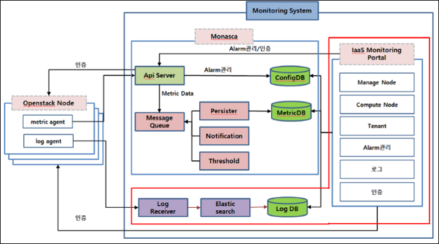<br/>
    <br/>

- PaaS Monitoring

    다음 그림은 PaaS 모니터링의 좀더 상세한 구조를 보여준다.<br/>
    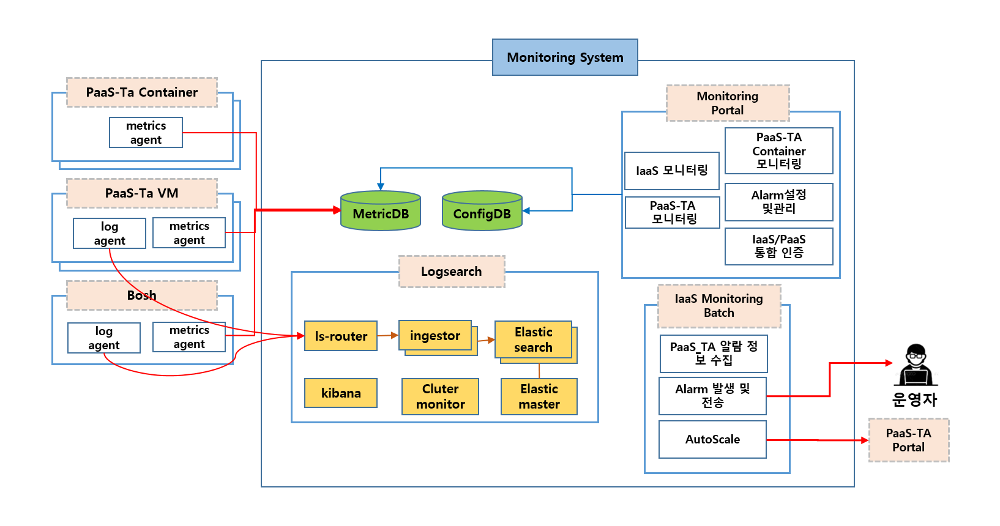<br/>
    <br/>

- CaaS Monitoring

    다음 그림은 CaaS 모니터링의 좀더 상세한 구조를 보여준다.<br/>
    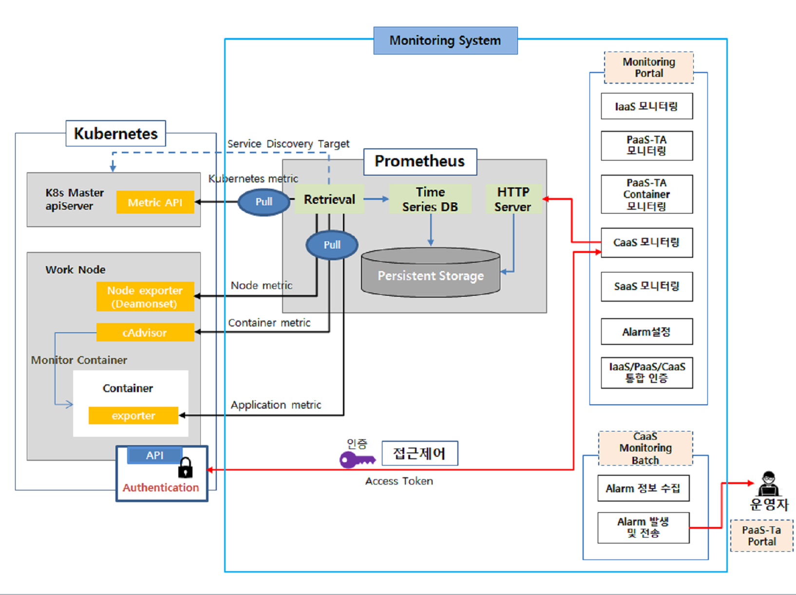<br/>
    <br/>
    
- SaaS Monitoring

    다음 그림은 SaaS 모니터링의 좀더 상세한 구조를 보여준다.<br/>
    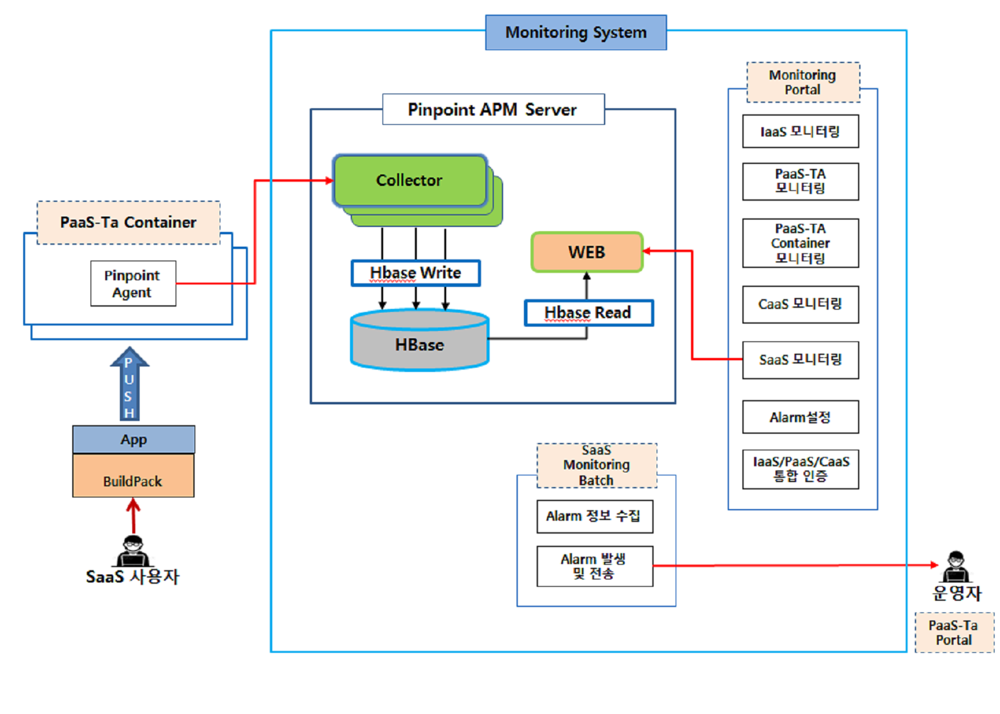<br/>
    <br/>    

<br/><br/>

### 3.1.2. Component 정보 <div id='3.1.2' />
| Component|설명|
|:--------|:--------|
|Manage Node|Controller/block Node/Network Node등의 시스템 자원 상태 정보를 조회한다.|
|Compute Node|Compute Node들의 시스템 자원 상태를 조회한다.|
|Tenant|Project별 생성된 Instance정보 및 자원상태를 조회한다.|
|Alarm 관리|Alarm 및 처리이력, Notification정보 등을 관리한다.|
|로그|Openstack Node들의 정보를 조회한다.|
|인증|IaaS Monitoring에 로그인 시 Openstack Keystone에 인증을 요청하여 token을 발급받아 로그인 처리를 한다.|

<br/>

### 3.1.3. 설정 정보 <div id='3.1.3' />
```
server.url = http://127.0.0.1:8080
server.port = 8080

#모니터링 시스템 사용 옵션 정보
#( IaaS : IaaS 만 사용 , PaaS : PaaS 만 사용, ALL : IaaS, PaaS 모두 사용)
#system.monitoring.type=PaaS
#system.monitoring.type=IaaS
system.monitoring.type=PaaS,CaaS,SaaS

# Monasca RDB 접속 정보
iaas.monitoring.db.type=mysql
iaas.monitoring.db.dbname=mon
iaas.monitoring.db.username=root
iaas.monitoring.db.password=wofl07
iaas.monitoring.db.host=xx.xxx.xxx.xxx
iaas.monitoring.db.port=33067

# InfluxDB
iaas.metric.db.username =
iaas.metric.db.password =
iaas.metric.db.url=http://xxx.xx.xxx.xxx:8086

iaas.metric.db.name=mon

# PaaS RDB 접속 정보
paas.monitoring.db.type=mysql
paas.monitoring.db.dbname=PaastaMonitoring
paas.monitoring.db.username=root
paas.monitoring.db.password=password
paas.monitoring.db.host=localhost
paas.monitoring.db.port=3306

paas.metric.db.username =
paas.metric.db.password =
paas.metric.db.url = http://xx.x.xxx.xxx:8086
paas.metric.db.name.paasta=cf_metric_db
paas.metric.db.name.bosh=bosh_metric_db
paas.metric.db.name.container=container_metric_db

# Openstack Admin
default.region=RegionOne
default.domain=default
default.username=admin
default.password=cfmonit
default.tenant_name=admin
default.tenant_id=61e66f7d847e4951aa38452fe74c93eb
identity.endpoint=http://xxx.xx.xxx.xxx:5000/v3
keystone.url=http://xxx.xx.xxx.xxx:35357/v3

# Monasca Api
monasca.url=http://xxx.xx.xxx.xxxx:8020/v2.0
monasca.connect.timeout=60
monasca.secure.tls=false

# Openstack Nova
nova.target.url=http://xxx.xx.xxx.xxx:8774
nova.target.version=v2.1
nova.target.tenant_id=61e66f7d847e4951aa38452fe74c93eb

# Openstack Keystone
keystone.target.url=http://xxx.xx.xxx.xxx:35357
keystone.target.version=v3

# Openstack Neutron
neutron.target.url=http://xxx.xx.xxx.xxx:9696
neutron.target.version=v2.0

# Openstack Cinder
cinder.target.url=http://xxx.xx.xxx.xxx:8776
cinder.target.version=v2

# Openstack Glance
glance.target.url=http://xxx.xx.xxx.xxx:9191
glance.target.version=v2

# RabbitMQ
rabbitmq.user=openstack
rabbitmq.pass=cfmonit
rabbitmq.ip=xxx.xx.xxx.xxx
rabbitmq.port=15672
rabbitmq.target.node=rabbit@controller

# Elasticsearch URL
iaas.elastic.url=xx.x.xxx.xxx:9200
paas.elastic.url=xx.x.xxx.xxx:9200

# Bosh Info
bosh.count=1
bosh.0.name=micro-bosh
bosh.0.ip=xx.x.x.x
bosh.0.deployname=bosh

# BOSH client
bosh.client.api.address=https://xx.x.x.x:25555
bosh.client.api.username=admin
bosh.client.api.password=admin_password

#disk mount point
disk.mount.point=/,/var/vcap/data
disk./.resp.json.name=/
disk./var/vcap/data.resp.json.name=data

#disk io mount point
disk.io.mount.point=/,/var/vcap/data
disk.io./.read.json.name=/-read
disk.io./.write.json.name=/-write
disk.io./var/vcap/data.read.json.name=data-read
disk.io./var/vcap/data.write.json.name=data-write

#network monitor item
network.monitor.item=eth0

# Time difference(hour)
gmt.time.gap=9

#cfProvider
paas.cf.client.apiaddress=https://api.xxx.xx.xxx.xxx.xip.io
paas.cf.client.skipsslvalidation=true

#redis
redis.addr=xxx.x.xx.xxx:6379
redis.password=password
redis.db=0

#Caas monitoring tool Prometheus
prometheus.addr=http://xx.x.xxx.xxx:30090

#Caas k8s ApiServer URL
kubernetesApi.addr=https://xx.x.x.xxx:8443
kubernetes.admin.token=

#SaaS Pinpoint Url
saas.pinpoint.url=http://xx.xxx.xxx.xx:8079
saas.pinpointWas.url=http://xx.x.xx.xxx:8080

paas.monitoring.cf.host=https://uaa.xx.xxx.xx.xx.xip.io
caas.monitoring.broker.host=http://xx.xxx.xx.xx:3334
```

### 3.1.4. API Package 구조 <div id='3.1.4' />
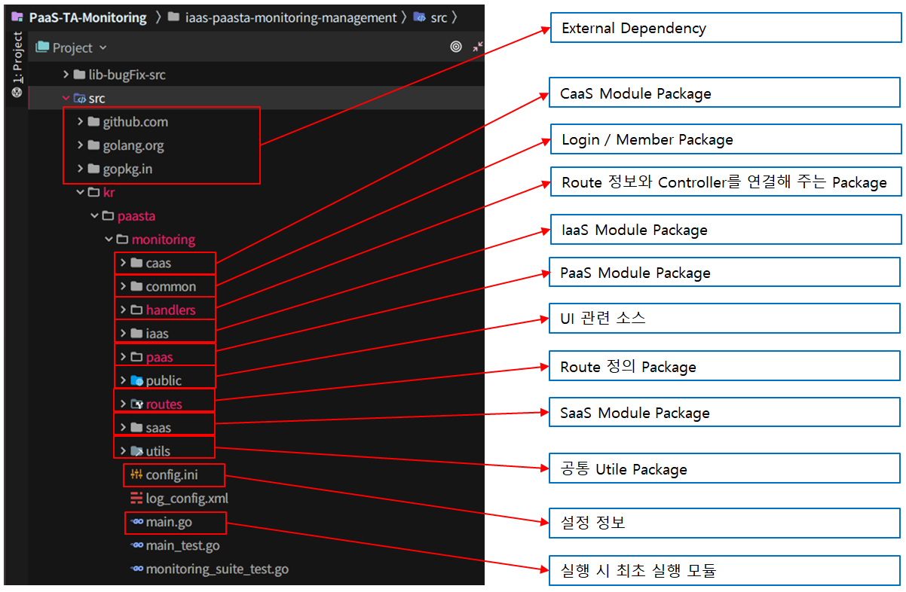<br/>
<br/>
    
### 3.1.5. API Package 간 호출 구조 <div id='3.1.5' />
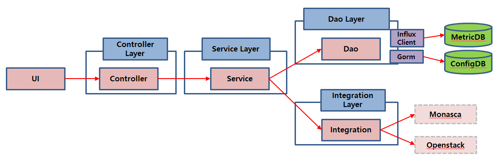<br/>
<br/>

### 3.1.6. UI Package 구조 <div id='3.1.6' />
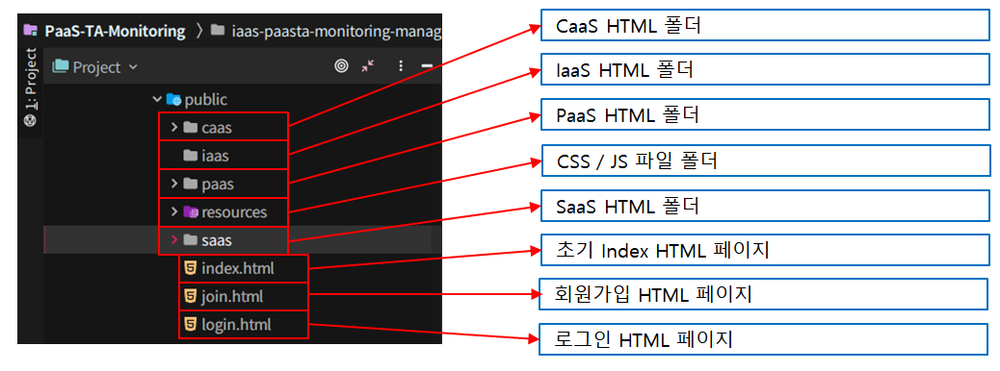<br/>
<br/>

### 3.1.7. UI Package 간 호출 구조 <div id='3.1.7' />
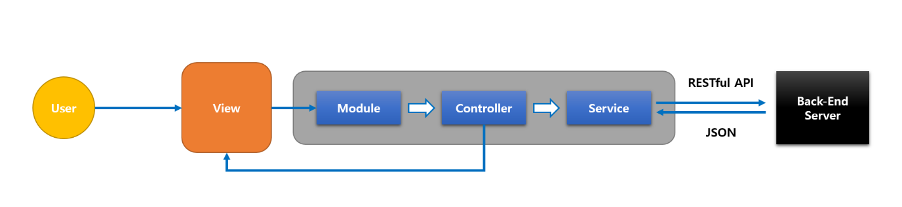<br/>
<br/>

### 3.1.8. 화면 <div id='3.1.8' />
> **Login** <div id='3.1.8.1' />

- 로그인 화면으로 IaaS / PaaS / CaaS / SaaS 통합 회원 ID/PW를 사용하여 Login을 한다.<br>
(시스템 및 사용자별 IaaS/PaaS /CaaS/SaaS 인증)
<br/>
<br><br>

> **Dashboard** <div id='3.1.8.2' />

- 통합 Dashboard 화면에서는 PaaS의 Bosh, PaaS-TA, Container의 상태 정보, CaaS의 Cluster, Workload, Pod의 상태 정보, SaaS의 Application JVM 자원 상태 정보, PaaS / CaaS / SaaS에서 발생된 알람 건수를 보여준다.
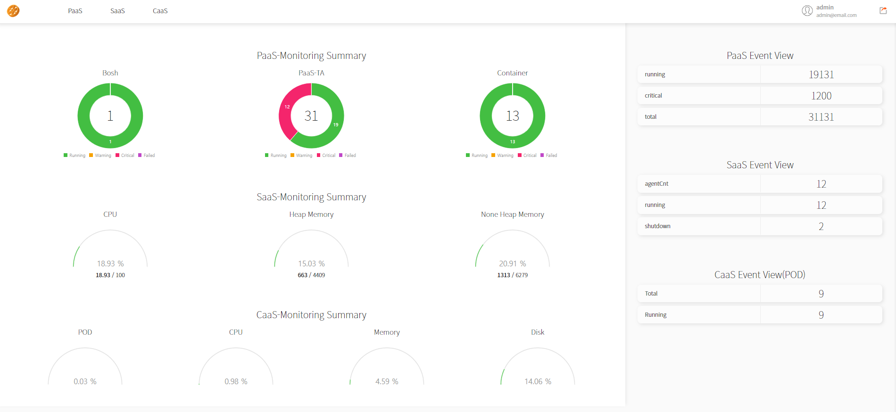<br/>
<br><br>


> **PaaS Main** <div id='3.1.8.15' />

- PaaS Main 화면에는 Bosh, PaaS-TA, Container 상태 정보 및 PaaS-TA VM 목록 정보, Zone-Container 관계 정보, 알람 발생 목록 정보를 보여준다.<br>
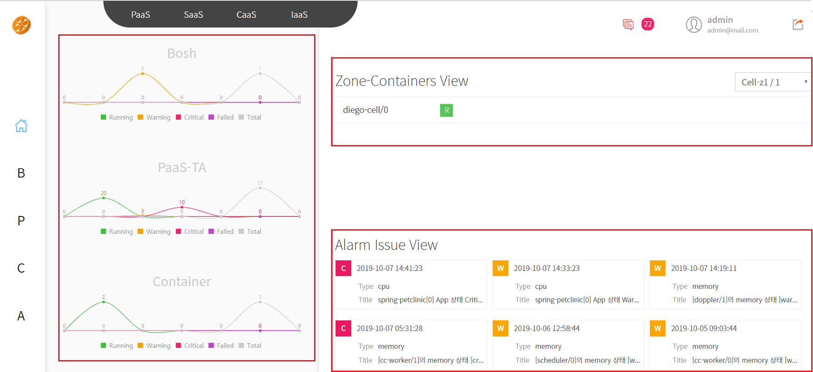<br>
<br><br>

> **Bosh Summary** <div id='3.1.8.16' />

- Bosh Summary 화면에는 Bosh 목록(micro-bosh)과 선택한 bosh의 Memory Top Process를 보여준다.
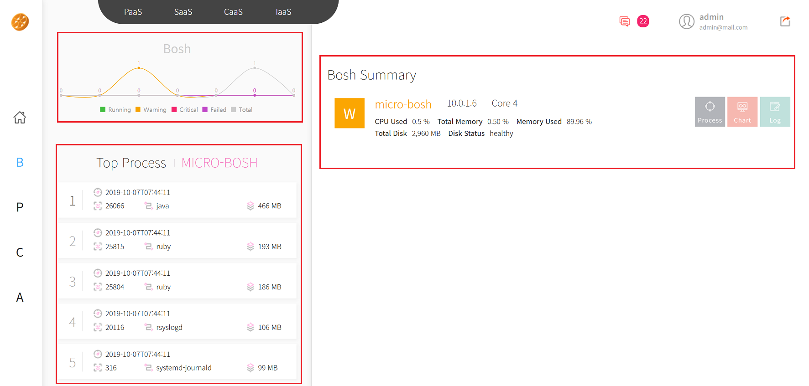<br>
<br><br>

> **Bosh Detail** <div id='3.1.8.17' />

- Bosh 상세화면에는 CPU, Memory, Disk, Network 정보를 보여준다.
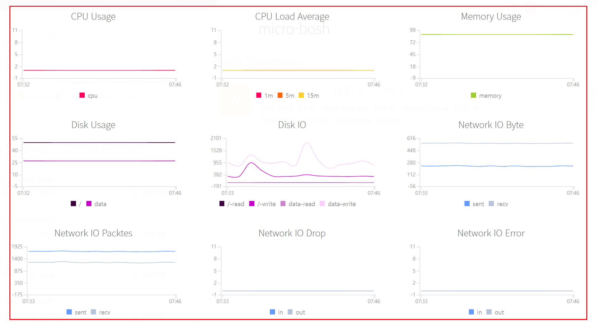<br>
<br>
- 두번째 탭에서는 발생된 Log 정보를 조회 할 수 있다.
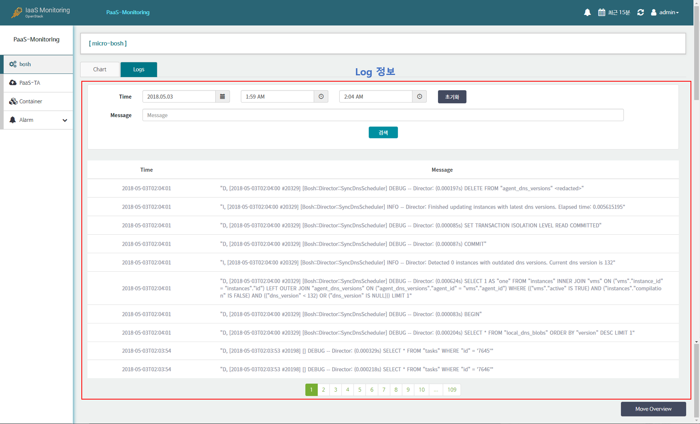<br>
<br><br>

> **PaaS-TA Summary** <div id='3.1.8.18' />

- PaaS-TA Summary 화면에는 PaaS-TA VM 상태별 개요 정보와 PaaS-TA VM 목록, 그리고 선택한 PaaS-TA의 Memory Top Process를 보여준다.
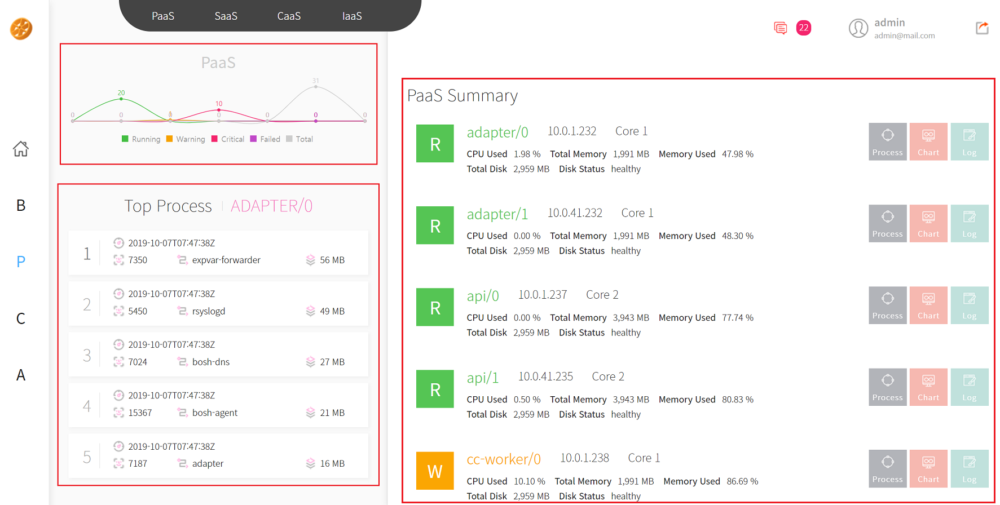<br>
<br><br>

> **PaaS-TA Detail** <div id='3.1.8.19' />

- PaaS-TA 상세화면에는 CPU, Memory, Disk, Network 정보를 보여준다.
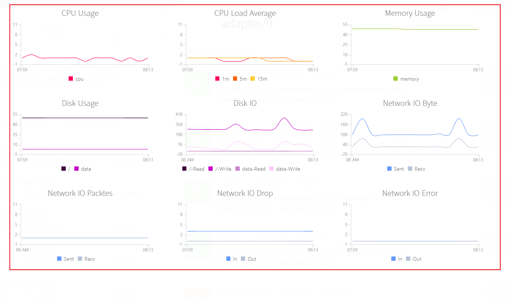<br>
<br>
- 두번째 탭에서는 발생된 Log 정보를 조회 할 수 있다.
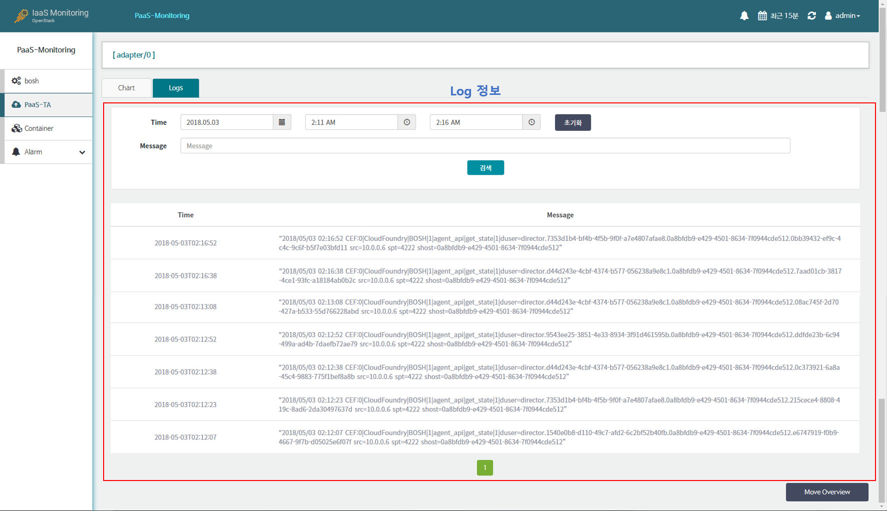<br>
<br><br>

> **Container Summary** <div id='3.1.8.20' />

- Container Summary 화면에는 Cell의 상태별 개요 정보와 Container 상태별 개요 정보, Container 목록 정보, Cell과 Container의 관계 정보를 보여준다.
<br>
<br><br>

> **Container Detail** <div id='3.1.8.21' />

- Container 상세화면에는 CPU, Memory, Disk, Network 정보를 보여준다.
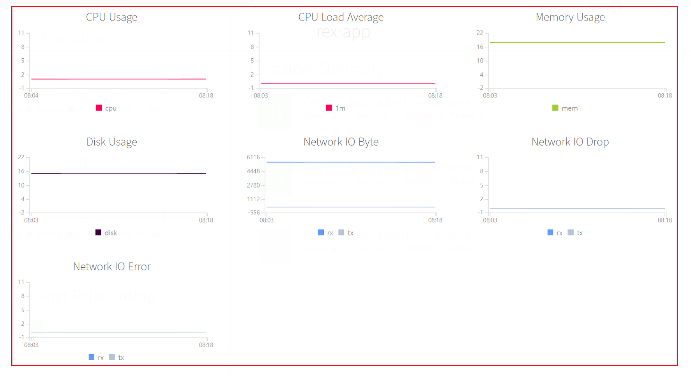<br>
<br><br>

> **Alarm Policy** <div id='3.1.8.22' />

- Alarm Policy 화면에는 Bosh, PaaS-TA, Container의 CPU, Memory, Disk별 임계치 및 알람수신자, 측정시간 정보를 보여준다. 또한 Telegram 수신 정보를 보여준다.
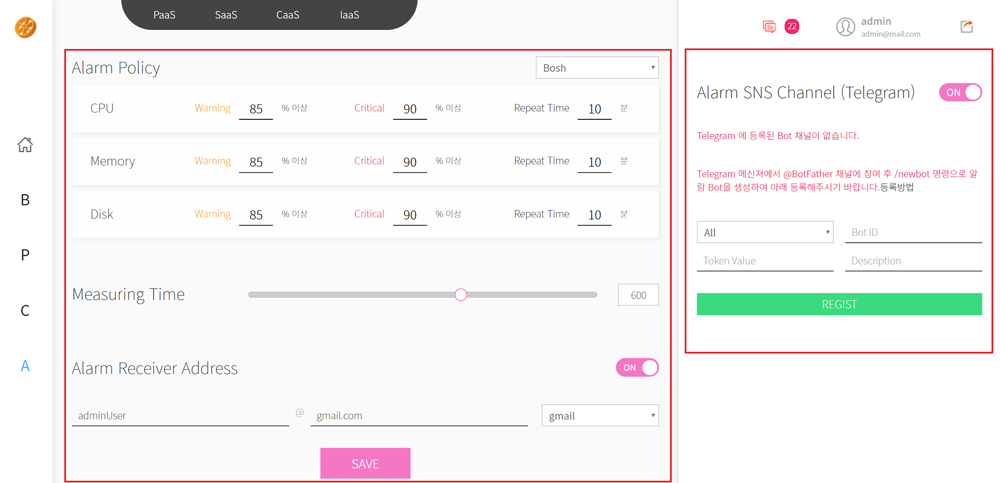<br>
<br><br>

> **Alarm Status** <div id='3.1.8.23' />

- Alarm Status 화면에는 설정한 임계치를 벗어나 발생된 알람 정보를 목록으로 보여준다.
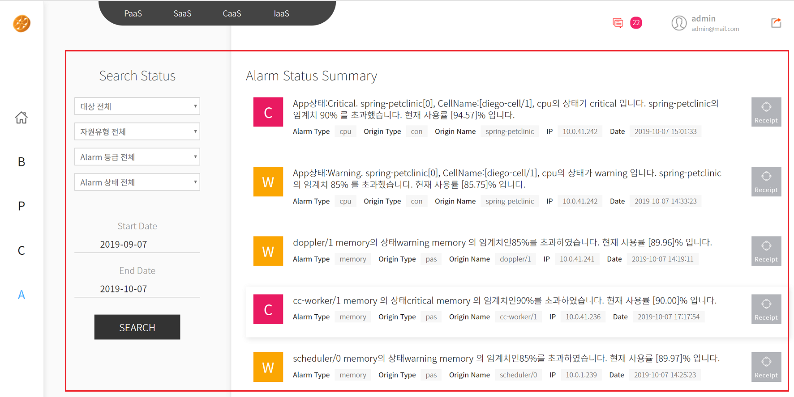<br>
<br><br>

> **Alarm Status Detail** <div id='3.1.8.24' />

- Alarm Status Detail 화면에는 발생된 알람 정보를 보여주고 또한 조치한 내역이 있을 경우 조치 내역도 보여준다.
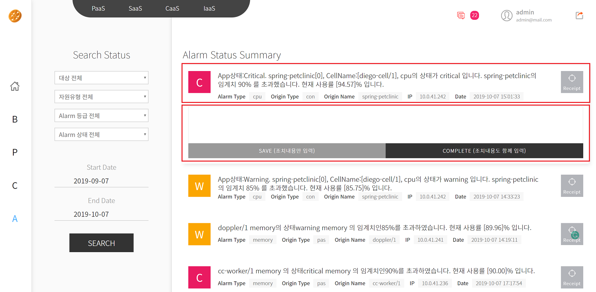<br>
<br><br>

> **Alarm Statistics** <div id='3.1.8.25' />

- Alarm Statistics 화면에는 일 / 주 / 월 / 년 별로 알람 발생 건수 통계 정보를 보여준다.
    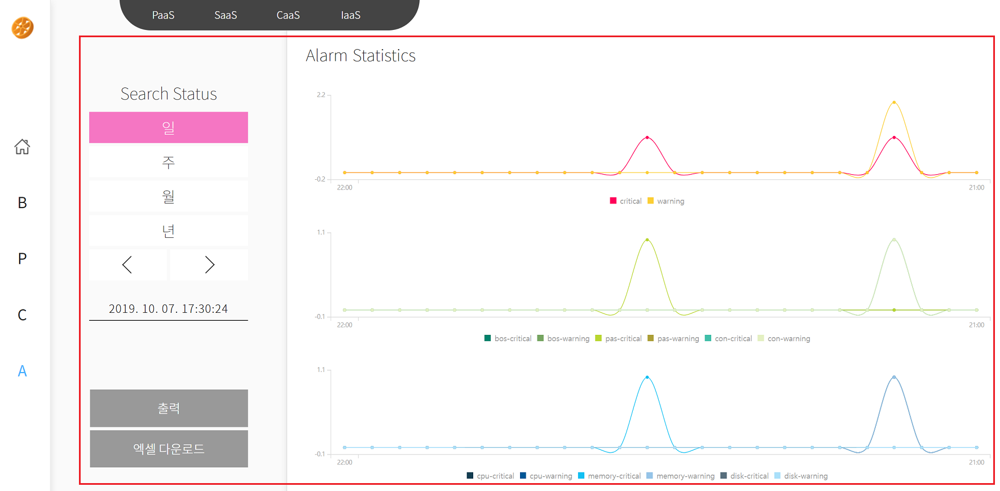<br>
    ※ 로컬 개발환경에서는 [출력]을 클릭할 경우 화면 깨짐 현상이 나타난다. 그 이유는 CSS경로를 서버로 설정되어 있어서 발생한다. 따라서 로컬 개발환경에서 확인 할 경우 빌드(gulp package) 후 localhost:8080로 접속하면 정상적으로 출력 화면이 보인다.
    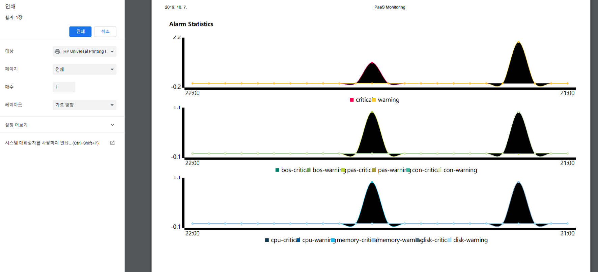<br>
    ※ 출력시 인쇄 화면이 나타나면 레이아웃으로 가로방향으로 지정해야 전체적인 화면에 출력된다.
<br><br>

> **CaaS Main** <div id='3.1.8.26' />

- CaaS Main 화면에는 Cluster 사용율, Deployment Replica Status, Stateful Replica Status,  DaemonSet Status, Pod Container Status 정보를 보여준다.<br>
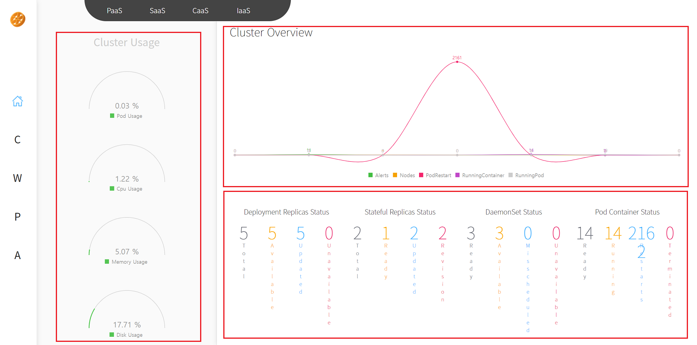<br>
<br><br>

> **CaaS Cluster** <div id='3.1.8.27' />

- CaaS Cluster 화면에는 Cluster 사용율, Cluster의 WorkNode CPU, Memory, Disk 사용율 정보 목록을 보여준다.<br>
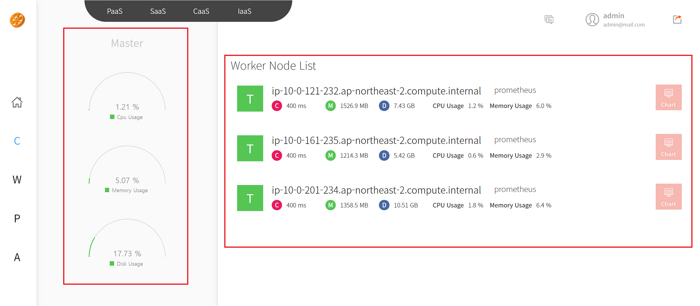<br>
<br><br>

> **CaaS Cluster Detail** <div id='3.1.8.28' />

- CaaS Cluster 상세화면에는 선택된 WorkNode의 POD, CPU, Memory, Disk 사용율 정보 목록을 보여준다.<br>
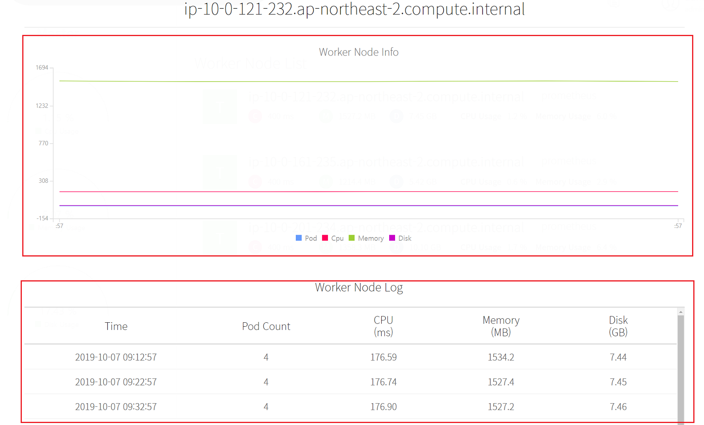<br>
<br><br>

> **CaaS WorkLoads** <div id='3.1.8.29' />

- CaaS Workloads 화면에는 Workload 상태정보 및 Workload(deployment, statefulset, daemonset)별 CPU, Memory, Disy 사용률 정보를 보여준다.<br>
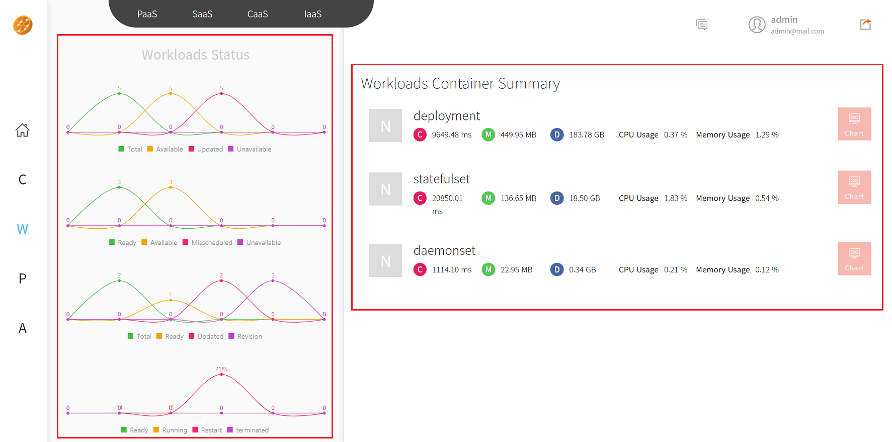<br>
<br><br>

> **CaaS WorkLoads Detail** <div id='3.1.8.30' />

- CaaS WorkLoads 상세화면에는 선택된 Workload의 Container 별 CPU, Memory, Disk 사용율 정보 목록을 보여준다.<br>
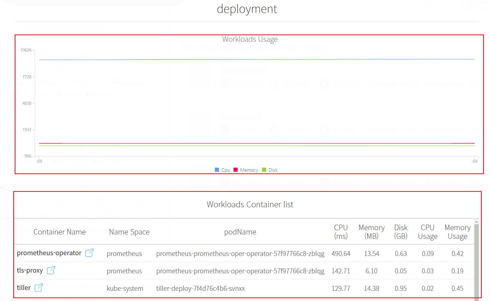<br>
<br><br>

> **CaaS Pod** <div id='3.1.8.31' />

- CaaS Pod 화면에는 Pod의 상태 정봐 및 Pod 별 CPU, Memory, Disk 사용율 정보 목록을 보여준다.<br>
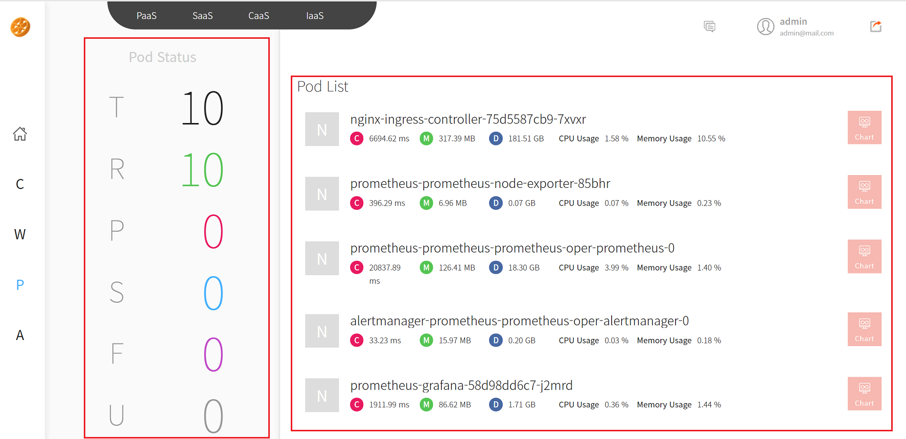<br>
<br><br>

> **CaaS Pod Detail** <div id='3.1.8.32' />

- CaaS Pod 상세화면에는 선택된 Pod의 Container 별 CPU, Memory, Disk 사용율 정보 목록을 보여준다.<br>
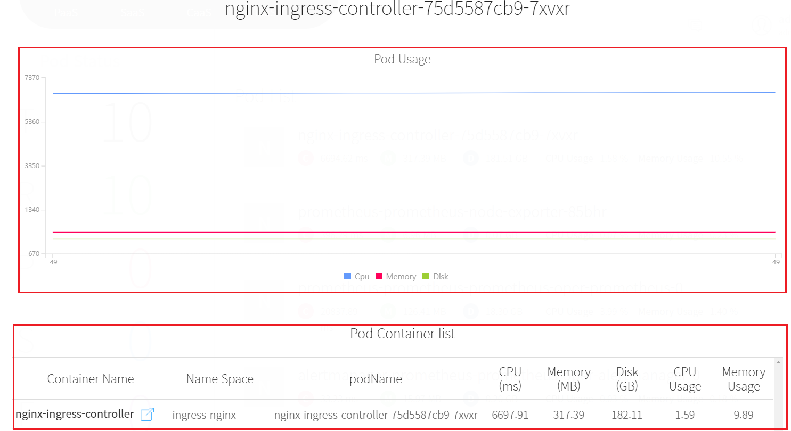<br>
<br><br>

> **CaaS Container Log** <div id='3.1.8.33' />

- CaaS Container Log 화면에는 선택된 Container 의 CPU, Memory, Disk 사용율 정보 및 로그 정보를 보여준다.<br>
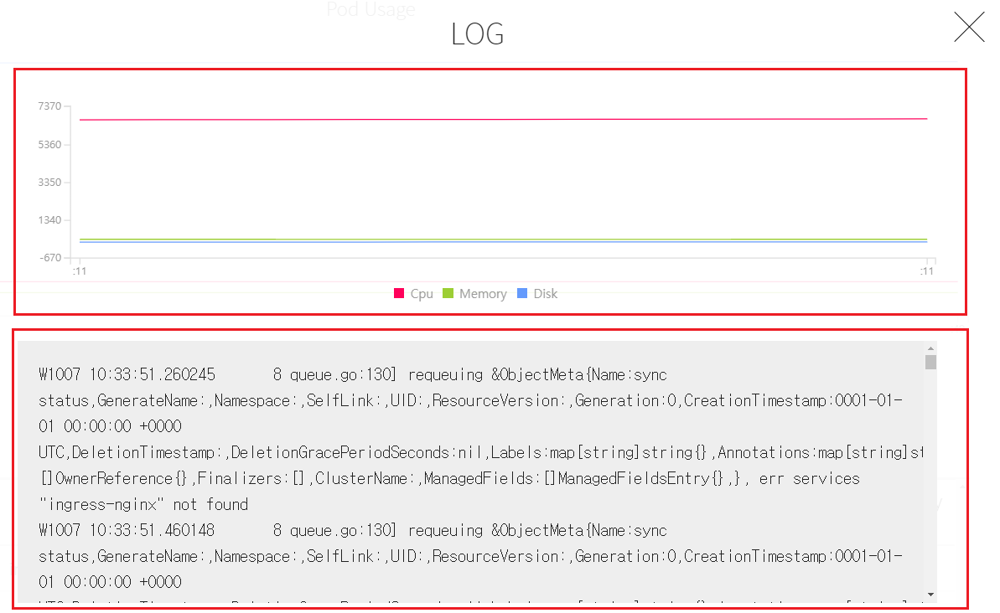<br>
<br><br>

> **CaaS Alarm Policy** <div id='3.1.8.34' />

- Alarm Policy 화면에는 Pod의 CPU, Memory, Disk별 임계치 및 알람수신자, 측정시간 정보를 보여준다. 또한 Telegram 수신 정보를 보여준다.
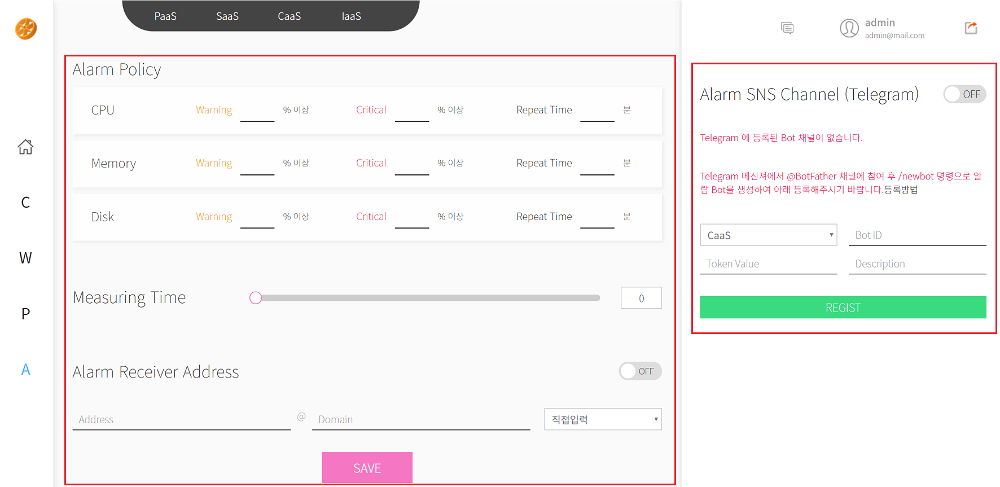<br>
<br><br>

> **CaaS Alarm Status** <div id='3.1.8.35' />

- Alarm Status 화면에는 설정한 임계치를 벗어나 발생된 알람 정보를 목록으로 보여준다.
<br>
<br><br>

> **CaaS Alarm Status Detail** <div id='3.1.8.36' />

- Alarm Status Detail 화면에는 발생된 알람 정보를 보여주고 또한 조치한 내역이 있을 경우 조치 내역도 보여준다.
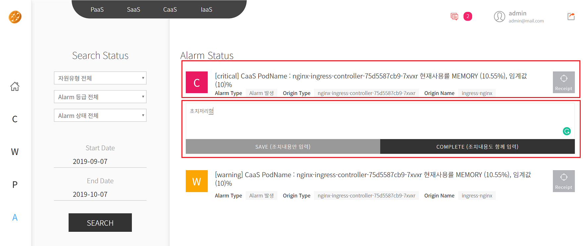<br>
<br><br>

> **SaaS Main** <div id='3.1.8.37' />

- SaaS Main 화면에는 Cluster 사용율, Deployment Replica Status, Stateful Replica Status,  DaemonSet Status, Pod Container Status 정보를 보여준다.<br>
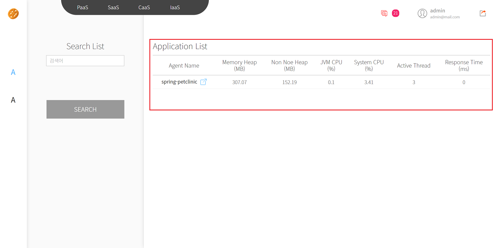<br>
<br><br>

> **SaaS PINPOINT** <div id='3.1.8.38' />

- SaaS PINPOINT 화면에는 선택된 Application의 PINPOINT APM 데시보드 화면을 보여준다.<br>
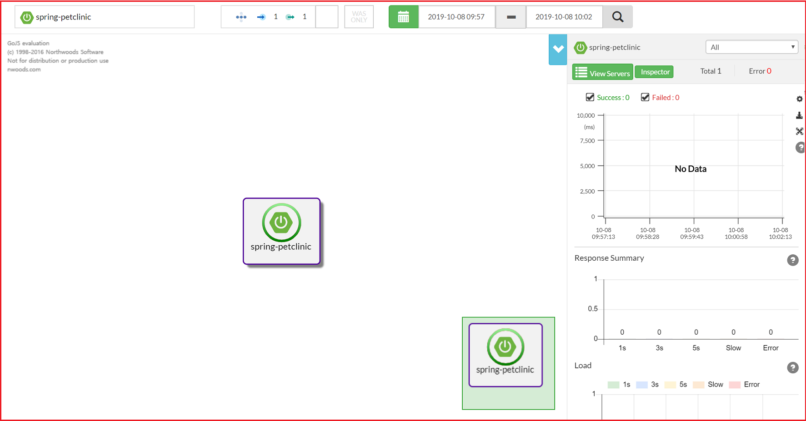<br>
<br><br>

> **SaaS Alarm Policy** <div id='3.1.8.39' />

- Alarm Policy 화면에는 Pod의 CPU, Memory, Disk별 임계치 및 알람수신자, 측정시간 정보를 보여준다. 또한 Telegram 수신 정보를 보여준다.
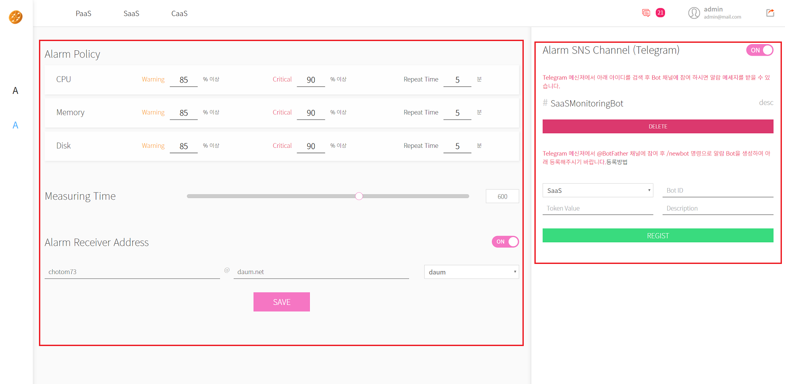<br>
<br><br>

> **SaaS Alarm Status** <div id='3.1.8.40' />

- Alarm Status 화면에는 설정한 임계치를 벗어나 발생된 알람 정보를 목록으로 보여준다.
<br>
<br><br>

> **CaaS SaaS Status Detail** <div id='3.1.8.41' />

- Alarm Status Detail 화면에는 발생된 알람 정보를 보여주고 또한 조치한 내역이 있을 경우 조치 내역도 보여준다.
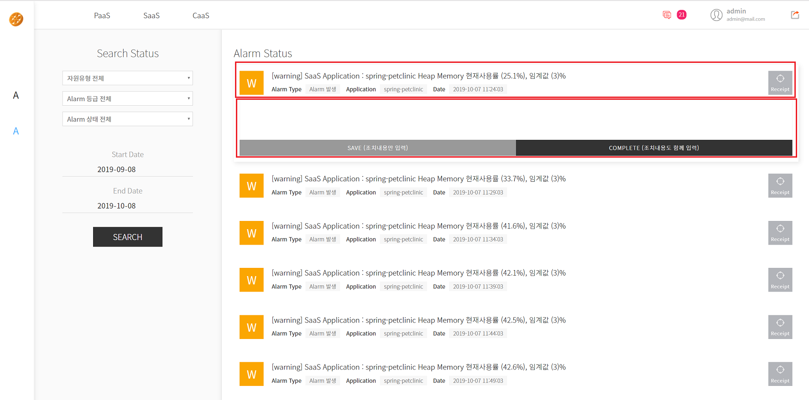<br>
<br><br>

## 3.2. PaaS-TA Monitoring Batch <div id='3.2' />
PaaS-TA-Monitoring-Batch는 Table 및 기초 Data를 구성하며, Influx에서 CPU/Memory/Disk 정보를 읽어 사용자에게 Alarm(Email / Telegram)을 전송하며, Alarm정보를 발생시킨다. AutoScale 시 PortalDB에서 AutoScale 정보를 읽어 임계치를 초과한 경우 PaaS-TA Portal에 Scale In/Out 요청을 한다.

### 3.2.1. 관련 Table 목록 및 구조 <div id='3.2.1' />
PaaS-TA-Monitoring-Batch는 다음 Table들과 연관관계를 갖는다. PaaS-TA-Monitoring-Batch는 기동시 PasstaMonitoring Database Table을 자동생성 및 기초 Data를 생성한다. 단, PasstaMonitoring Database는 생성 후 config 파일에 설정한다.

\<PaaS-TA Monitoring Database\>

|Table명|설명|
|:--------|:--------|
|alarms|Batch가 MetricDB정보를 읽어 임계치를 초과한 경우 Alarm이 발생한다. Alarm이 발생하면 Email로 관리자에게 알람 메시지가 전송된다.| 
|alarm_actions|Alarm 메시지를 전송받은 관리자가알람 접수 후 해결 과정을 기술한다. (이슈관리)|
|alarm_policies|Alarm 임계치 정보를 설정한다.|
|alarm_sns|알람 발생시 알람 전송 받을 채널(Telegram)을 정의한다.|
|alarm_sns_targets|알람 발생시 알람 전송 받을 채널에 포함되 ID 정보 목록|
|alarm_target|알람 발생시 알람 전송받을 채널(EMAIL)을 정의한다.|
|vms|PaaS-TA VM 정보|
|zones|PaaS-TA VM들이 속한 Zone정보 목록|


\<PaaS-TA Portal Database\>

|Table명|설명|
|:--------|:--------|
|app_auto_scaling_policies|Portal 앱 Auto-Scaling 임계치 정보를 설정한다.|
|app_alarm_policies|Portal 앱 Alarm 임계치 정보를 설정한다.|
|app_alarm_histories|Portal 앱 알람 발송 이력 정보|

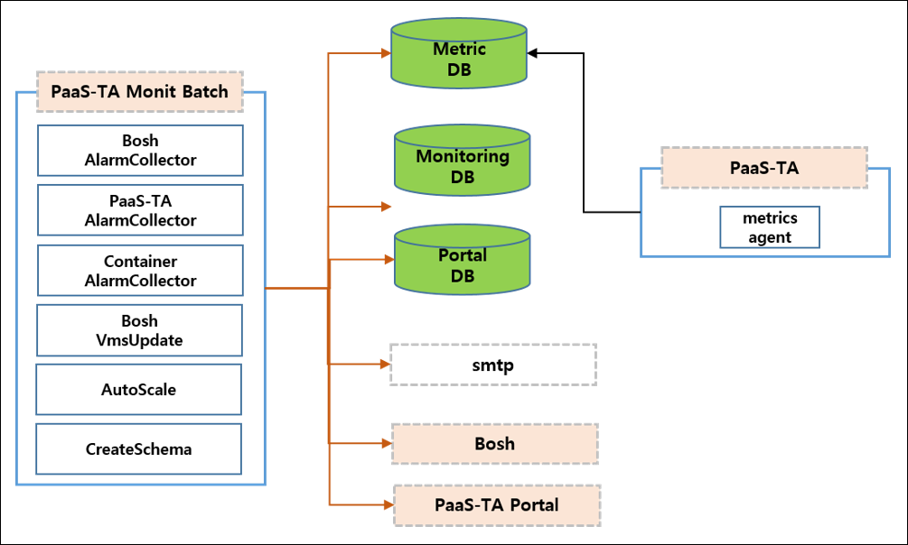
그림 1. Monitoring-Batch 구성도
<br><br><br>

### 3.2.2. Component 정보 <div id='3.2.2' />
|Component|설명|
|:--------|:--------|
|Auto Scale|PaaS-TA Portal Database에서 Auto Scale정보를 조회하여 임계치를 초과하거나 이하인 경우 Applicatio Scale In/Out 처리를 PaaS-TA Portal에 요청한다.|
|Bosh Alarm Collector|Bosh Metric 정보(CPU/Memory/Disk) 상태 정보를 읽어 정의된 임계치 초과시 관리자에게 Alarm 발송한다.|
|Bosh Vms Update|Bosh에 Vm정보를 요청하여 MonitoringDB 에 동기화 한다. (Table : zones, vms)|
|Create Schema|PaaS-TA-Monitoring Database에서 사용할 Table을 생성한다.<br>Bosh에서 CF VM 정보를 읽어 PaaS-TA-Monitoring Database와 동기화 처리를 한다.<br>PaaS-TA-Monitoring시스템에서 사용할 기초 정보를 생성한다.
|Container Alarm Collector|Container Metric 정보(CPU/Memory/Disk) 상태 정보를 읽어 정의된 임계치 초과시 관리자에게 Alarm 발송한다.|
|PaaS-TA Alarm Collector|PaaS-TA Metric 정보(CPU/Memory/Disk) 상태 정보를 읽어 정의된 임계치 초과시 관리자에게 Alarm 발송한다.|
|Portal App Alarm Collector|PaaS-TA Portal Database에 정의된 Alarm 임계치 정보로 Application 알람 발생시 알람을 발생하고 알림 이력을 저장한다.|
|Update SNS Alarm Target|알람 발생시 알람 전송받을 Telegram 채널에 등록된 사용자 ID를 PaaS-TA Monitoring Database에 동기화 처리를 한다.|

<br>

### 3.2.3. 설정 정보 <div id='3.2.3' />
```
# Web Server Port
server.port = 9999
running.env=running

# InfluxDB
influx.cf_measurement = cf_metrics
influx.cf_process_measurement = cf_process_metrics
influx.url =http://xxx.xxx.xxx.xxx:8086

# Metric DB Name
influx.paasta.db_name=cf_metric_db
influx.bosh.db_name=bosh_metric_db
influx.container.db_name=container_metric_db
influx.defaultTimeRange = 130s

# MonitoringDB 접속 정보
monitoring.db.type=mysql

# Paas-TA Batch Monitoring DB 접속 정보
monitoring.db.dbname=PaastaMonitoring
monitoring.db.username=root
monitoring.db.password=password
monitoring.db.host=xxx.xxx.xxx.xxx
monitoring.db.port=3306

# MonitoringDB 접속 정보
portal.db.type=mysql

# PaaS-TA Portal Monitoring DB 접속 정보
portal.db.dbname=portaldb
portal.db.username=root
portal.db.password=admin
portal.db.host=xxx.xxx.xxx.xxx
portal.db.port=3306

# bosh 정보
bosh.api.url=xxx.xxx.xxx.xxx:25555
bosh.ip=xxx.xxx.xxx.xxx
bosh.admin=id
bosh.password=password
bosh.cf.deployment.name=cf           → paasta-controller deployment 명이 일치 해야함.
bosh.cell.name.prefix=cell              → paasta cell VM의 prefix 명이 일치 해야함.
bosh.service.name=bosh               → bosh 명이 일치 해야함.

# e-mail 정보
mail.smtp.host=smtp.gmail.com        → Alarm 전송할 SMTP Server 명
mail.smtp.port=465                   → Alarm 전송할 SMTP Server Port
mail.sender=xxxxxxxx@gmail.com      → Alarm 발송자 e-mail 주소
mail.sender.password=paasword       → Alarm 발송자 SMTP 비밀번호
mail.resource.url=url                  → Monit-API URL 주소
mail.alarm.send=true                 → Alarm 발생시 e-mail 전송 여부

batch.interval.second=60              → PaaS-TA Batch Monitoring 실행 주기
gmt.time.hour.gap=0                 → GMT 시간과 차이 설정
                                    → 한국일 경우 -9로 설정

# Portal API
portal.api.url=url                      → PaaS-TA Portal URL 주소
user.portal.alarm.interval=60            → PaaS-TA Portal Monitoring 실행 주기

# redis
redis.addr=xxx.xxx.xxx.xxx:xxxx
redis.password=password
redis.db=0
```
    
### 3.2.4. Package 구조 <div id='3.2.4' />
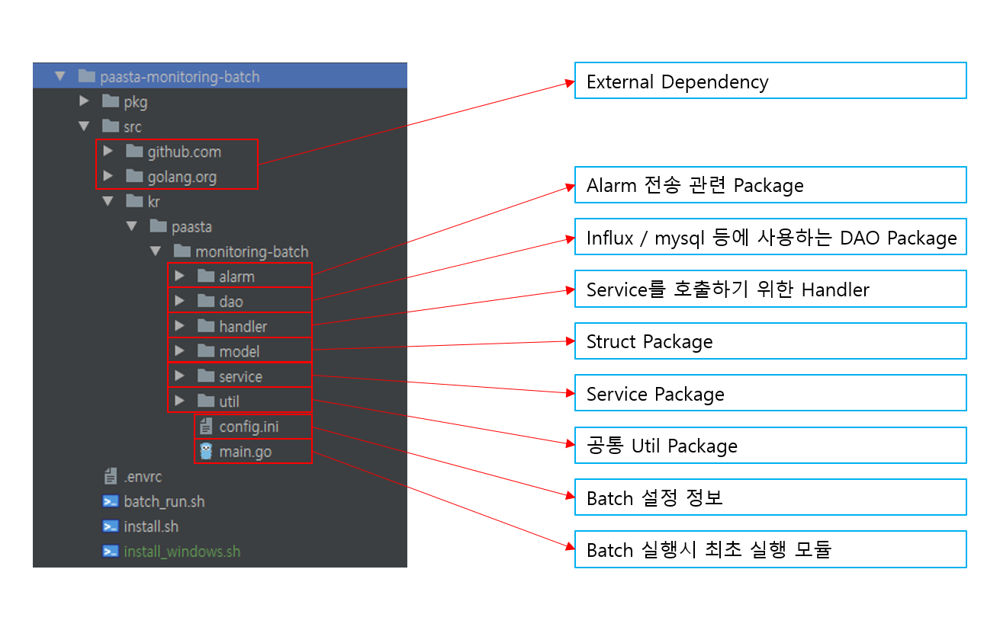
<br><br><br>

### 3.2.5. Package 간 호출 구조 <div id='3.2.5' />

<br><br><br>

### 3.2.6. Alarm Message <div id='3.2.6' />

> **e-mail** <div id='3.2.6.1' />


<br><br><br>

> **telegram** <div id='3.2.6.2' />


<br><br><br>

## 3.3. CaaS Monitoring Batch <div id='3.3' />
CaaS-Monitoring-Batch는 Table 및 기초 Data를 구성하며, Prometheus Metric CPU/Memory/Disk 정보를 읽어 사용자에게 Alarm(Email / Telegram)을 전송하며, Alarm정보를 발생시킨다.

### 3.3.1. 관련 Table 목록 및 구조 <div id='3.3.1' />
CaaS-Monitoring-Batch는 다음 Table들과 연관관계를 갖는다. CaaS-TA-Monitoring-Batch는 기동시 PasstaMonitoring Database Table을 자동생성 한다. 단, PasstaMonitoring Database는 생성 후 config 파일에 설정한다.

\<PasstaMonitoring Database\>

|Table명|설명|
|:--------|:--------|
|batch_alarm_infos|Alarm 임계치 및 스케쥴 정보를 설정한다.|
|batch_alarm_receivers|Alarm 수신 정보를 설정한다.|
|batch_alarm_executions|발생된 알람 정보.|
|batch_alarm_execution_resolves|Alarm 메시지를 전송 받은 관리자가 알람 접수 후 해결 과정을 기술한다. (이슈관리)|
|batch_alarm_sns|Alarm 발생시 전송 받을 채널(Telegram)을 정의한다.|

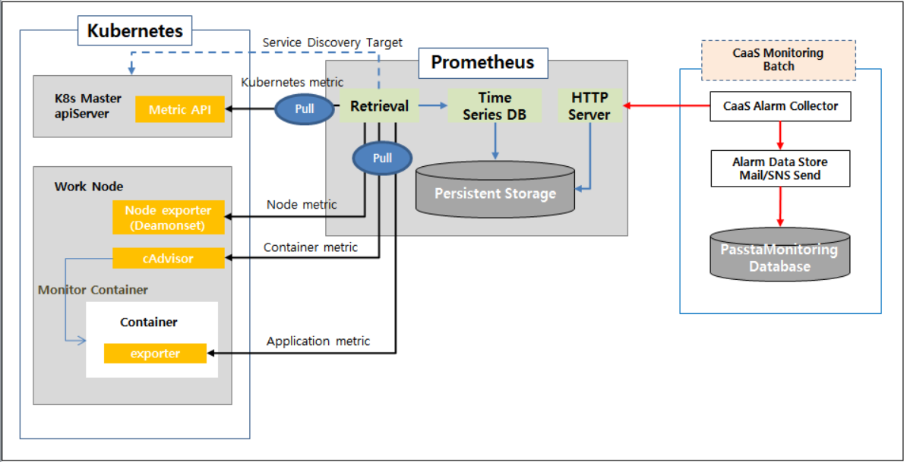
그림 1. Monitoring-Batch 구성도
<br><br><br>

### 3.3.2. Component 정보 <div id='3.3.2' />
|Component|설명|
|:--------|:--------|
|Pod Alarm Collector|Pod Metric 정보(CPU/Memory/Disk) 상태 정보를 읽어 정의된 임계치 초과시 관리자에게 Alarm 발송한다.|
|Update SNS Alarm Target|알람 발생시 알람 전송받을 Telegram 채널에 등록된 사용자 ID를 PasstaMonitoring Database에 동기화 처리를 한다.|

<br>

### 3.3.3. 설정 정보 <div id='3.3.3' />
```
# monitoring RDB 접속 정보
monitoring.db.type=mysql
monitoring.db.dbname=PaastaMonitoring
monitoring.db.username=root
monitoring.db.password=password
monitoring.db.host=xx.x.xxx.xxx
monitoring.db.port=3306

# SMTP
mail.smtp.host=smtp.naver.com
mail.smtp.port=587
mail.sender.password=xxxxx
mail.sender=xxxx@naver.com
mail.resource.url=http://xx.xx.xx.x:8080

# CaaS Info
caas.monitoring.api.url = http://xx.xx.xx.xxx:8080
```
    
### 3.3.4. Package 구조 <div id='3.3.4' />
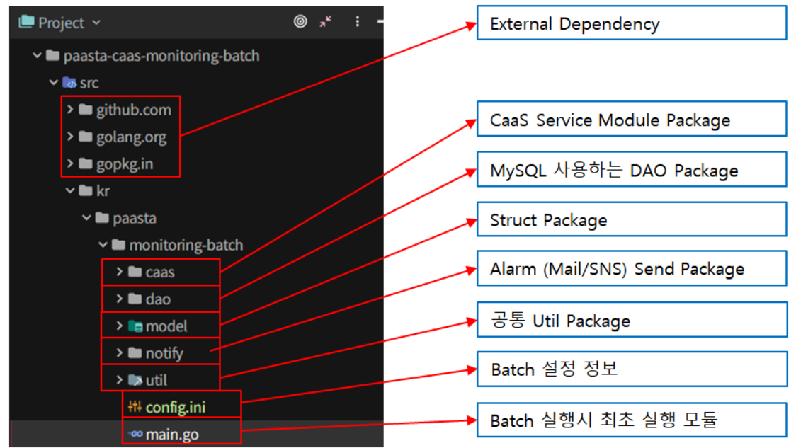
<br><br><br>

### 3.3.5. Package 간 호출 구조 <div id='3.3.5' />
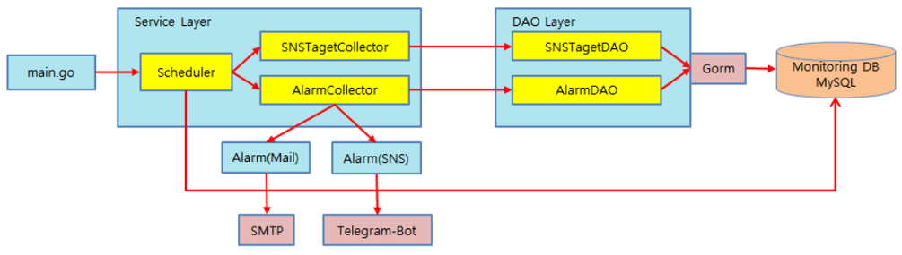
<br><br><br>

### 3.3.6. Alarm Message <div id='3.3.6' />

> **e-mail** <div id='3.3.6.1' />

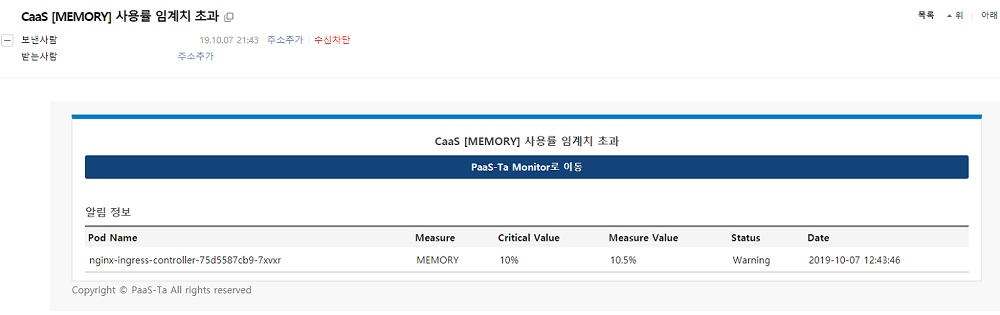
<br><br><br>

> **telegram** <div id='3.3.6.2' />

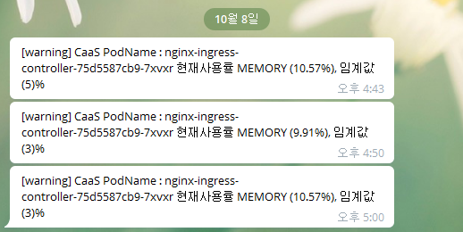
<br><br><br>


## 3.4. SaaS Monitoring Batch <div id='3.4' />
SaaS-Monitoring-Batch는 Table 및 기초 Data를 구성하며, PINPOINT Metric System CPU/JVM CPU/Heap Memory 정보를 읽어 사용자에게 Alarm(Email / Telegram)을 전송하며, Alarm정보를 발생시킨다.

### 3.4.1. 관련 Table 목록 및 구조 <div id='3.4.1' />
SaaS-Monitoring-Batch는 다음 Table들과 연관관계를 갖는다. SaaS-TA-Monitoring-Batch는 기동시 PasstaMonitoring Database Table을 자동생성 한다. 단, PasstaMonitoring Database는 생성 후 config 파일에 설정한다.

\<PasstaMonitoring Database\>

|Table명|설명|
|:--------|:--------|
|batch_alarm_infos|Alarm 임계치 및 스케쥴 정보를 설정한다.|
|batch_alarm_receivers|Alarm 수신 정보를 설정한다.|
|batch_alarm_executions|발생된 알람 정보.|
|batch_alarm_execution_resolves|Alarm 메시지를 전송 받은 관리자가 알람 접수 후 해결 과정을 기술한다. (이슈관리)|
|batch_alarm_sns|Alarm 발생시 전송 받을 채널(Telegram)을 정의한다.|

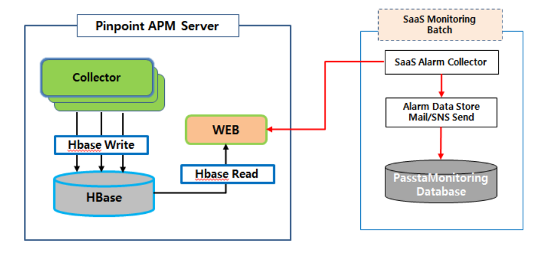
그림 1. Monitoring-Batch 구성도
<br><br><br>

### 3.4.2. Component 정보 <div id='3.4.2' />
|Component|설명|
|:--------|:--------|
|Application Alarm Collector|Application Metric 정보(System CPU/JVM CPU/Heap Memory) 상태 정보를 읽어 정의된 임계치 초과시 관리자에게 Alarm 발송한다.|
|Update SNS Alarm Target|알람 발생시 알람 전송받을 Telegram 채널에 등록된 사용자 ID를 PasstaMonitoring Database에 동기화 처리를 한다.|

<br>

### 3.4.3. 설정 정보 <div id='3.4.3' />
```
# monitoring RDB 접속 정보
monitoring.db.type=mysql
monitoring.db.dbname=PaastaMonitoring
monitoring.db.username=root
monitoring.db.password=password
monitoring.db.host=xx.x.xxx.100
monitoring.db.port=3306


# SMTP
mail.smtp.host=smtp.naver.com
mail.smtp.port=587
mail.sender.password=xxxxxx
mail.sender=xxxxxx@naver.com
mail.resource.url=http://xxx.xxx.xx.xx:8080

# SaaS Info
saas.pinpoint.url = http://xx.xx.xxx.xxx:8079
```
    
### 3.4.4. Package 구조 <div id='3.4.4' />

<br><br><br>

### 3.4.5. Package 간 호출 구조 <div id='3.4.5' />

<br><br><br>

### 3.4.6. Alarm Message <div id='3.4.6' />

> **e-mail** <div id='3.4.6.1' />

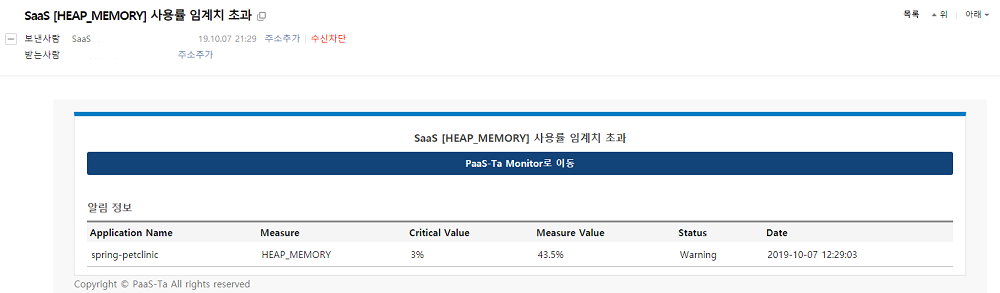
<br><br><br>

> **telegram** <div id='3.4.6.2' />

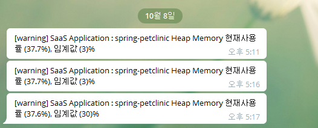
<br><br><br>

## 3.5. Paas-Ta Monitoring Guide Agent 구성 <div id='3.5' />

<br>

### 3.5.1. 개요 <div id='3.5.1' />
> 클라우드 서비스(IaaS/PaaS/CaaS/SaaS) 통합 운영관리 기술 개발 프로젝트의 Monitoring 시스템에서 Metric 데이터를 수집하고 TSDB(InfluxDB)로 저장하기위한 Guide용 Agent에 대한 설치 및 구성에 대해 설명한다.

<br>

### 3.5.2. PaaS Metrics Agent 개발환경 구성 <div id='3.5.2' />

<br>

#### 3.5.2.1. bosh-metrics-agent 개요 <div id='3.5.2.1' />
bosh-metrics-agent는 PaaS 환경에 Monitoring을 하고자 PaaS-TA 배포 시 Bosh Director, PaaS-TA vms 에 구성되는 Metrics Agent.

<br>

#### 3.5.2.2. bosh-metrics-agent 개발환경 구성 <div id='3.5.2.2' />

> 애플리케이션 개발을 위해 다음과 같은 환경으로 개발환경을 구성 한다.
```
- OS : Ubuntu 16.04
- Golang : 1.15.3
- Dependencies :  code.cloudfoundry.org/lager
		  code.cloudfoundry.org/debugserver
		  code.cloudfoundry.org/runtimeschema/cc_messages/flags
                  github.com/tedsuo/ifrit
		  github.com/tedsuo/ifrit/grouper
		  github.com/tedsuo/ifrit/sigmon
                  github.com/influxdata/influxdb/client/v2
		  github.com/shirou/gopsutil/cpu
		  github.com/shirou/gopsutil/disk
	          github.com/shirou/gopsutil/host
	          github.com/shirou/gopsutil/load
	          github.com/shirou/gopsutil/mem
	          github.com/shirou/gopsutil/net
	          github.com/shirou/gopsutil/process
- IDE : GoLand(유료), Intellij IDEA 2019(무료), Visual Studio Code(무료), etc... 중 택일.
- 형상관리: Git, etc... 중 택일.
```
※ Intellij IDEA 는 Commnuity와 Ultimate 버전이 있는데, Community 버전은 Free이고, Ultimate 버전은 은 30-day trial버전이다. Community는 Version 2019.2 이하에서 환경 구성이 가능하다.

<br>

#### 3.5.2.3. bosh-metrics-agent release 구성 <div id='3.5.2.3' />

PaSTA-Release -> paasta-monitoring -> paasta-monitoring-agent.tgz 에 반영되어 Deploy 해야 한다.

( PaaS-TA v5.0 패키지 파일 다운로드 참조)
- https://paas-ta.kr/download/package
<br><br><br>
