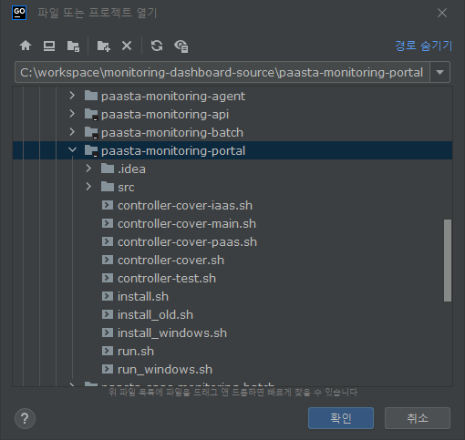
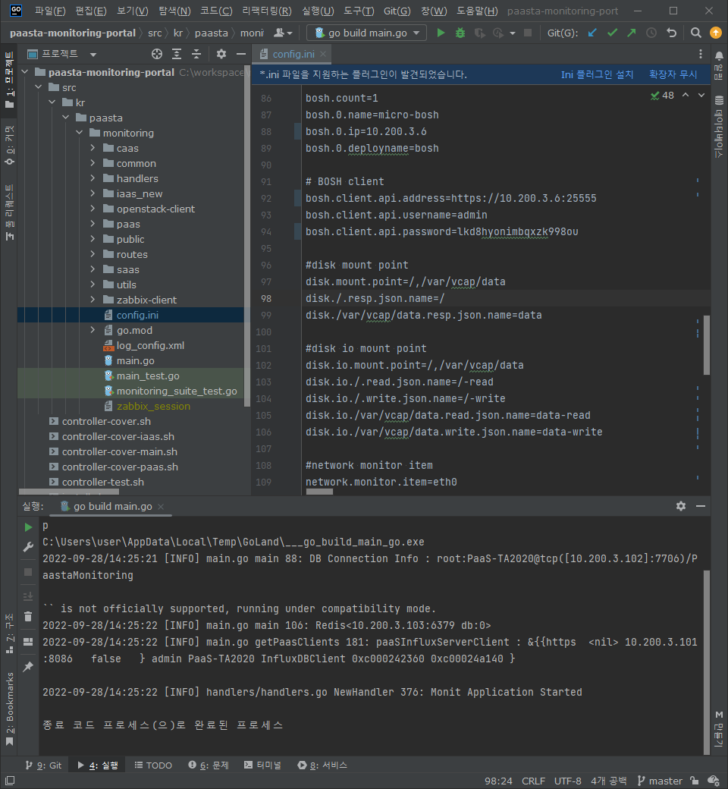
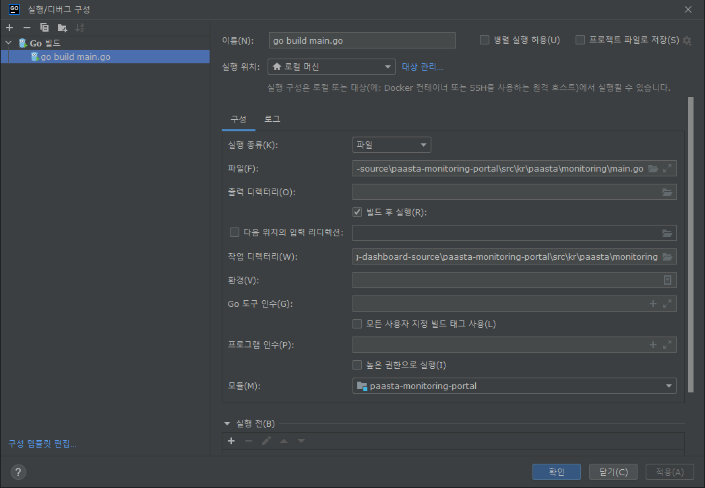
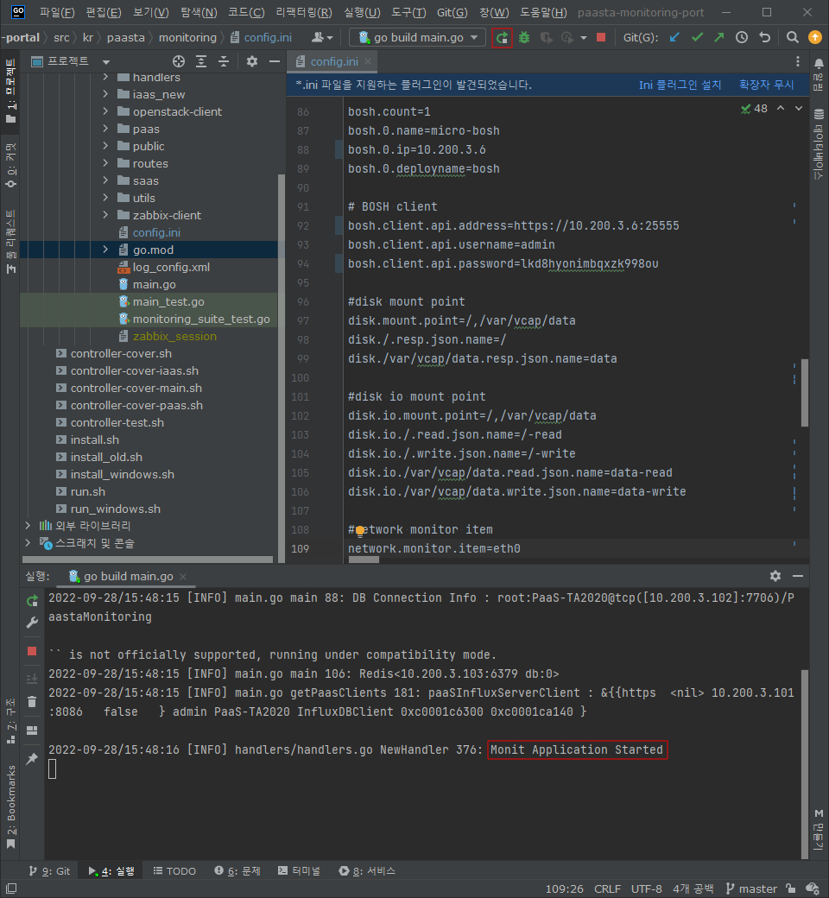
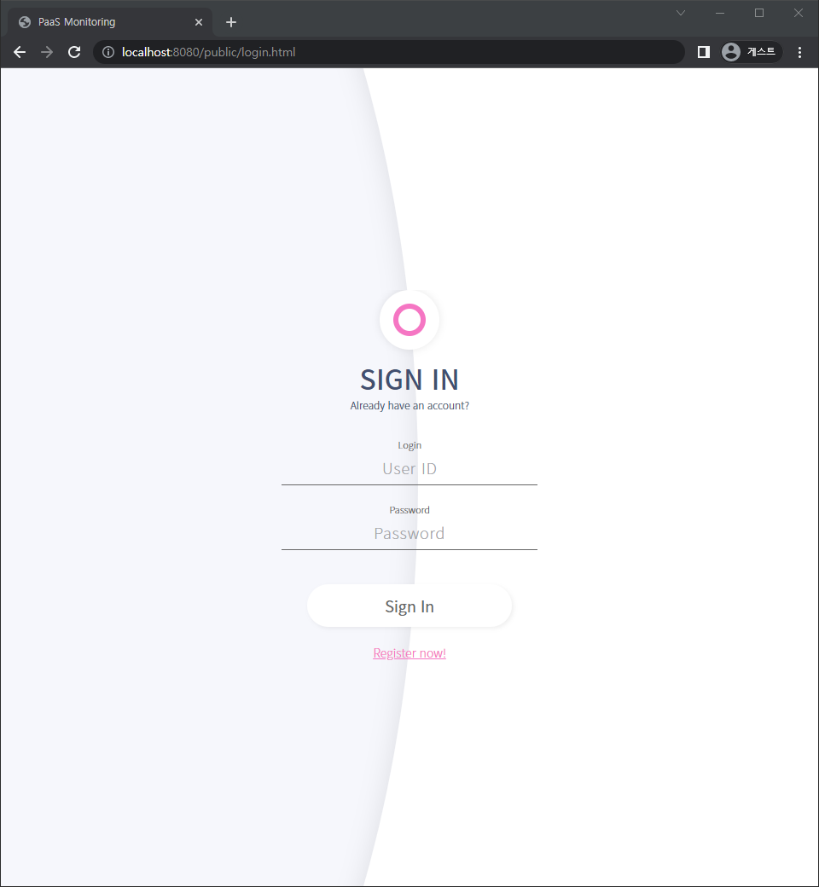

## Related Repositories
<table>
  <tr>
    <td colspan=2 align=center>플랫폼</td>
    <td colspan=2 align=center><a href="https://github.com/PaaS-TA/paasta-deployment">어플리케이션 플랫폼</a></td>
    <td colspan=2 align=center><a href="https://github.com/PaaS-TA/paas-ta-container-platform">컨테이너 플랫폼</a></td>
  </tr>
  <tr>
    <td colspan=2 rowspan=2 align=center>포털</td>
    <td colspan=2 align=center><a href="https://github.com/PaaS-TA/portal-deployment">AP 포털</a></td>
    <td colspan=2 align=center><a href="https://github.com/PaaS-TA/container-platform-portal-release">CP 포털</a></td>
  </tr>
  <tr align=center>
    <td colspan=4>🚩 <a href="https://github.com/PaaS-TA/monitoring-dashboard-source">모니터링 대시보드</a></td>
  </tr>
  <tr align=center>
    <td rowspan=2 colspan=2><a href="https://github.com/PaaS-TA/monitoring-deployment">모니터링</a></td>
    <td><a href="https://github.com/PaaS-TA/monitoring-dashboard-release">Monitoring</a></td>
    <td><a href="https://github.com/PaaS-TA/monitoring-influxdb-release">InfluxDB</a></td>
    <td><a href="https://github.com/PaaS-TA/monitoring-redis-release">Redis</a></td>
    <td></td>
  </tr>
  <tr align=center>
    <td><a href="https://github.com/PaaS-TA/monitoring-pinpoint-release">Pinpoint</td>
    <td><a href="https://github.com/PaaS-TA/monitoring-pinpoint-buildpack">Pinpoint Buildpack</td>
    <td><a href="https://github.com/PaaS-TA/monitoring-zabbix-release">Zabbix</a></td>
    <td></td>
  </tr>
  </tr>
  <tr align=center>
    <td rowspan=4 colspan=2><a href="https://github.com/PaaS-TA/service-deployment">AP 서비스</a></td>
    <td><a href="https://github.com/PaaS-TA/PAAS-TA-CUBRID-RELEASE">Cubrid</a></td>
    <td><a href="https://github.com/PaaS-TA/PAAS-TA-API-GATEWAY-SERVICE-RELEASE">Gateway</a></td>
    <td><a href="https://github.com/PaaS-TA/PAAS-TA-GLUSTERFS-RELEASE">GlusterFS</a></td>
    <td><a href="https://github.com/PaaS-TA/PAAS-TA-APP-LIFECYCLE-SERVICE-RELEASE">Lifecycle</a></td>
  </tr>
  <tr align=center>
    <td><a href="https://github.com/PaaS-TA/PAAS-TA-LOGGING-SERVICE-RELEASE">Logging</a></td>
    <td><a href="https://github.com/PaaS-TA/PAAS-TA-MONGODB-SHARD-RELEASE">MongoDB</a></td>
    <td><a href="https://github.com/PaaS-TA/PAAS-TA-MYSQL-RELEASE">MySQL</a></td>
    <td><a href="https://github.com/PaaS-TA/PAAS-TA-PINPOINT-RELEASE">Pinpoint APM</a></td>
  </tr>
  <tr align=center>
    <td><a href="https://github.com/PaaS-TA/PAAS-TA-DELIVERY-PIPELINE-RELEASE">Pipeline</a></td>
    <td align=center><a href="https://github.com/PaaS-TA/rabbitmq-release">RabbitMQ</a></td>
    <td><a href="https://github.com/PaaS-TA/PAAS-TA-ON-DEMAND-REDIS-RELEASE">Redis</a></td>
    <td><a href="https://github.com/PaaS-TA/PAAS-TA-SOURCE-CONTROL-RELEASE">Source Control</a></td>
  </tr>
  <tr align=center>
    <td><a href="https://github.com/PaaS-TA/PAAS-TA-WEB-IDE-RELEASE-NEW">WEB-IDE</a></td>
    <td></td>
    <td></td>
    <td></td>
  </tr>
  <tr align=center>
    <td rowspan=1 colspan=2><a href="https://github.com/PaaS-TA/paas-ta-container-platform-deployment">CP 서비스</a></td>
    <td><a href="https://github.com/PaaS-TA/container-platform-pipeline-release">Pipeline</a></td>
    <td><a href="https://github.com/PaaS-TA/container-platform-source-control-release">Source Control</a></td>
    <td></td>
    <td></td>
  </tr>
</table>
<i>🚩 You are here.</i>

# PaaS-TA monitoring-dashboard-source
1. 개요
2. 선행 요소
3. 개발환경 설정
4. 모듈/패키지 단위 디렉터리별 명세

## 1. 개요
이 문서는 본 저장소를 이용하여 로컬 개발환경을 구성하고, 모듈 및 패키지 단위 소스코드 레벨의 하위 디렉터리별 설명을 명세한 가이드를 제공하기 위해 작성되었다.

## 2. 선행 요소
본 저장소를 통해 공개된 모듈 또는 패키지 단위의 실행 프로그램의 일부는 개발환경 설정시에 애플리케이션을 실행하는데 필요한 다른 주변 애플리케이션(DB 등)과의 선행적 연결 수립이 요구되기도 한다. 따라서 개발환경 설정에 앞서 PaaS-TA 애플리케이션 플랫폼(AP), 컨테이너 플랫폼(CP), 모니터링 플랫폼(Monitoring Dashboard)의 배포가 선행될 수 있도록 해야 한다. 각 플랫폼의 설치는 [공식 가이드](https://github.com/PaaS-TA/Guide)의 설치 가이드를 참고할 수 있다.

## 3. 개발환경 설정
본 문서의 개발환경은 윈도우 운영체제를 기준으로 하고 있으며 애플리케이션 개발을 위한 IDE로는 GoLand를 사용하고 있다. 다음 내용을 통해 로컬 개발환경을 설정하는 방법을 참고할 수 있다.

### 3.1. GoLand 설치
다음 경로를 통해 JetBrains 사에서 제공하는 30일간 사용 가능한 Goland IDE 설치 파일을 다운로드 받을 수 있다. 설치 파일 다운로드 후 설치 마법사의 안내에 따라 설치를 완료한다.

**[ GoLand IDE Download](https://www.jetbrains.com/go/download/#section=windows)**

### 3.2. GoLand 설정
본 내용은 **PaaS-TA Monitoring Web (Portal)** 애플리케이션 개발환경 설정을 예시로 작성하였다. 아래 원격 저장소를 통해 애플리케이션 개발에 필요한 소스코드 전체를 다운로드 받을 수 있다.

**[ PaaS-TA/monitoring-dashboard-source Download](https://github.com/PaaS-TA/monitoring-dashboard-source)**

**PaaS-TA Monitoring Web (Portal)** 개발을 위해 GoLand를 실행한 후 다운로드 받은 패키지 구조 중 `paasta-monitoring-portal` 디렉터리를 프로젝트로 연다.

`config.ini` 파일에 '2. 선행 요소'에서 언급했던 주변 실행 환경의 연결 정보 또는 접속 정보를 알맞게 입력한다.

상단 메뉴 바의 **[실행]** > **[구성 편집]** 메뉴를 선택한다. 이어서 **[실행/디버그 구성]** 창의 설정을 다음을 참고해 설정한다.

ㆍ**실행 종류** : 파일  
ㆍ**파일** : `...\monitoring-dashboard-source\paasta-monitoring-portal\src\kr\paasta\monitoring\main.go`  
ㆍ**작업 디렉터리** : `...\monitoring-dashboard-source\paasta-monitoring-portal\src\kr\paasta\monitoring`

우측 상단의 실행 버튼(Shift + F10)을 눌러 프로그램을 실행한다. 정상적으로 실행되면 IDE 하단의 실행 로그에 'Monit Application Started'라는 메시지가 노출된다.

웹 브라우저에서 **_'localhost:8080'_** 경로를 통해 로컬에서 GoLand를 기반으로 실행된 애플리케이션의 웹 화면을 확인할 수 있다. 

## 3. 모듈/패키지 단위 디렉터리별 명세
### ┃ Agent Modules
　** paasta-agents** ― _AP diego-cell VM 기반 컨테이너 환경(Garden-runC)의 메트릭 정보를 수집/전송하는 에이전트_  
　├  cadvisor  
　└  rep

　** paasta-monitoring-agent** ― _BOSH 포함 AP를 구성하는 VM 기반 환경의 메트릭 정보를 수집/전송하는 에이전트_  
　└  src/kr/paasta/monitoring_agent  
　　├  handler  
　　└  services

### ┃ Batch Modules
　** paasta-monitoring-batch** ― _AP 시스템 메트릭 조건에 따라 알람을 전송하는 배치 모듈_  
　└  src/kr/paasta/monitoring-batch  
　　├  alarm  
　　├  dao  
　　├  handler  
　　├  model  
　　├  service  
　　└  util
  
　** paasta-caas-monitoring-batch** ― _CP 시스템 메트릭 조건에 따라 알람을 전송하는 배치 모듈_  
　└  src/kr/paasta/monitoring-batch  
　　├  caas  
　　├  config  
　　├  dao  
　　├  model  
　　├  notify  
　　└  util

　** paasta-saas-monitoring-batch** ― _애플리케이션 시스템 메트릭 조건에 따라 알람을 전송하는 배치 모듈_  
　└  src/kr/paasta/monitoring-batch  
　　├  dao  
　　├  model  
　　├  notify  
　　├  saas  
　　└  util

　** paasta-iaas-monitoring-batch** ― _인프라 시스템 메트릭에 조건에 따라 알람을 전송하는 배치 모듈_  
　└  src/kr/paasta/iaas-monitoring-batch  
　　├  config  
　　├  dao  
　　├  model  
　　├  service  
　　├  util  
　　└  zabbix-client

### ┃ Interface Modules
　** paasta-monitoring-api** ― _모니터링 기능을 통합 제공하는 API 모듈 및 Swagger 기반 API 가이더_  
　└  src/kr/paasta/monitoring-api  
　　├  apiHelpers  
　　├  connections  
　　├  controllers  
　　├  dao  
　　├  docs  
　　├  helpers  
　　├  middlewares  
　　├  models  
　　├  routers  
　　└  services

　** paasta-monitoring-portal** ― _모니터링 정보와 수치를 시각화한 GUI를 제공하는 웹 애플리케이션_  
　└  src/kr/paasta/monitoring  
　　├  caas  
　　├  common  
　　├  handlers  
　　├  iaas_new  
　　├  openstack-client  
　　├  paas  
　　├  public  
　　├  routes  
　　├  saas  
　　├  utils  
　　└  zabbix-client

