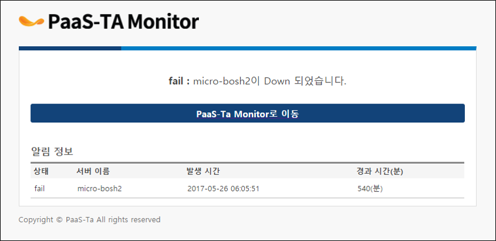

PaaS-TA-Monitoring-2.0_Batch
=============================

##### 이어서

1. [개요](#1)
2. [Dependencies Module Download](#2)
    * [Paasta-monitoring-batch Dependency Download](#3)
3. [PaaS-TA 모니터링 애플리케이션 구성](#4)
    *  [PaaS-TA 모니터링Batch](#5)
        *  [관련 Table목록 및 구조](#6)    
        *  [PaaS-TA Monitoring-Batch Component](#7) 
        *  [PaaS-TA Monitoring-Batch 설정정보](#8)
        *  [PaaS-TA Monitoring-Batch Package 구조](#9) 
        *  [PaaS-TA Monitoring-Batch Package간 호출 구조](#10) 
        *  [PaaS-TA Monitoring-Batch Alarm Message](#11) 
        *  [PaaS-TA 모니터링Batch PaaS-TA](#12)
            *  [Linux](#13)   
            *  [windows](#14)                 
        *  [PaaS-TA 모니터링Batch PaaS-TA 배포](#15)
            *  [Manifest.yml](#16)
            *  [PaaS-TA 배포	](#17)       

    

#   2. Dependencies Module Download 

##   2.1. Paasta-monitoring-batch Dependency Download 
   

> Dos 창을 오픈한다.

    $ cd \PaaS-TA-Monitoring\paasta-monitoring-batch
    $ set GOPATH='현재 디렉토리 경로"
    $ set PATH=%PATH%;%GOPATH%bin;

> 입력창에 아래와 같이 입력한다.

    $ go get github.com/tedsuo/ifrit
    $ go get github.com/go-sql-driver/mysql
    $ go get github.com/jinzhu/gorm
    $ go get github.com/influxdata/influxdb/client/v2
    $ go get github.com/cloudfoundry-community/gogobosh
    $ go get golang.org/x/oauth2
    $ go get golang.org/x/net/context
    $ go get github.com/onsi/ginkgo
    $ go go get github.com/onsi/gomega
    $ go get github.com/tools/godep
    $ go get golang.org/x/sys/unix
    
 

     
- src 디렉토리에 Dependencies 소스들이 다운로드 되어 있음을 확인한다.

  

# 3. PaaS-TA 모니터링 애플리케이션 구성 
   
> PaaS-TA 모니터링 Application은 Monitoring Batch/Management로 구성되어 있다. 
  Batch는 PaaS-TA Component 감시역할을 하며 Alarm정책에 위배 되었을 때 Alarm을 발생한다. 
  Management는 Alarm Web App으로 컨테이너 배치현황, 알람통계, 알람 정보등을 사용자에게 제공한다. 
  Monitoring Batch는 Table schema 및 기초Data를 생성하는 역할을 하기 떄문에 
  Monitoring-Batch가 실행 된 후 Monitoring-Management가 실행되어야 한다.
  
   
 
 - 그림 1. PaaS-TA Monitoring 구성도
 
<table>
    <tr>
        <th>프로젝트</th>
        <th>기능</th>
    </tr>
    <tr>
        <td>pasta-monitoring-batch</td>
        <td>
            Table Schema 생성 및 기초 Data생성  
            AutoScale In/Out  
            Alarm 발생
        </td>
    </tr>
</table> 
    
 

## 3.1. PaaS-TA 모니터링Batch 
  

> Monitoring-Batch는 Table 및 기초 Data를 구성하며, Influx에서 CPU/Memory/Disk 정보를 읽어 
사용자에게 Alarm(Email)을 전송하며, Alarm정보를 발생시킨다. AutoScale 시 PortalDB에서 AutoScale 정보를 읽어 
임계치를 초과한 경우 PaaS-TA Portal에 Scale In/Out 요청을 한다. 

 

### 3.1.1. 관련 Table목록 및 구조 
  

> Monitoring-Batch는 다음 Table들과 연관관계를 갖는다. 
  Monitoring-Batch는 기동시 MonitoringDB Table을 자동생성 및 기초 Data를 생성한다.
  
 

**Monitoring DB**
 
<table>
    <tr>
        <th>Table명</th>
        <th>설명</th>
    </tr>
    <tr>
        <td>alarms</td>
        <td>
            Batch가 MetricDB정보를 읽어 임계치를 초과한 경우 Alarm이 발생한다. Alarm이 발생하면 Email로 관리자에게 알람 메시지가 전송된다. 
        </td>
    </tr>
    <tr>
        <td>
            alarm_actions
        </td>
        <td>
            Alarm 메시지를 전송받은 관리자가알람 접수 후 해결 과정을 기술한다. (이슈관리)    
        </td>
    </tr>  
    <tr>
        <td>
            alarm_policies
        </td>
        <td>
            Alarm 임계치 정보를 설정한다. 
        </td>
    </tr>
    <tr>
        <td>
            alarm_target
        </td>
        <td>
            알람 발생시 알람 전송받을 채널(EMAIL)을 정의한다.    
        </td>
    </tr>
    <tr>
        <td>vms</td>
        <td>
            PaaS-TA VM 정보 
        </td>
    </tr>
    <tr>
        <td>zones</td>
        <td>
            PaaS-TA VM들이 속한 Zone정보 목록
        </td>
    </tr>            
</table> 

 

**Portal DB**

<table>
    <tr>
        <th>Table명</th>
        <th>설명</th>
    </tr>
    <tr>
        <td>Auto_scaling_config</td>
        <td>
            AutoScale In/Out 할 App 정보 대상목록 
            (Data는 PaaS-TA  Portal이 제공한다.) 
        </td>
    </tr>      
</table>  

 

  
 
  
 
 ### 3.1.2. PaaS-TA Monitoring-Batch Component 
  
 

<table>
    <tr>
        <th>Component</th>
        <th>설명</th>
    </tr>
    <tr>
        <td>CreateSchema</td>
        <td>
            MonitoringDB에서 사용할 Table을 생성한다. 
            Bosh 에서 CF VM 정보를 읽어 MonitoringDB 와 동기화 처리를 한다. 
            Monitoring 시스템에서 사용할 기초 정보를 생성한다. 
        </td>
    </tr>
    <tr>
        <td>
            PaaS-TA Alarm Collector
        </td>
        <td>
            PaaS-TA Metric 정보(CPU/Memory/Disk) 상태 정보르 읽어 임계치초과시 관리자에게 Alarm 발송한다.    
        </td>
    </tr>  
    <tr>
        <td>
            Container Alarm Collector
        </td>
        <td>
            Container Metric 정보(CPU/Memory/Disk) 상태 정보르 읽어 임계치초과시 관리자에게 Alarm 발송한다.
        </td>
    </tr>
    <tr>
        <td>
            Bosh Alarm Collector
        </td>
        <td>
            Bosh Metric 정보(CPU/Memory/Disk) 상태 정보르 읽어 임계치초과시 관리자에게 Alarm 발송한다.
        </td>
    </tr>
    <tr>
        <td>AutoScale</td>
        <td>
            PaaS-TA PortalDB에서 AutoScale정보를 조회하여 임계치 Min/Max 를 초과하거나 이하인 경우 App Scale In/Out처리를 PaaS-TA Portal에 요청한다.
        </td>
    </tr>
    <tr>
        <td>Bosh VmsUpdate</td>
        <td>
            Bosh에 Vm정보를 요청하여 MonitoringDB 에 동기화 한다.
            (zones, vms Table)
        </td>
    </tr>       
 </table> 
     
  
 
 ### 3.1.3. PaaS-TA Monitoring-Batch 설정정보 

 
 > Monitoring-Batch는 Config.ini에 관련 속성정보를 정의한다.
     
    # Server Port
    server.port = 9999  
    
    # MetricDB(InfluxDB) 접속정보
    influx.user =
    influx.pass =
    influx.cf_measurement = cf_metrics
    influx.cf_process_measurement = cf_process_metrics
    influx.url = http://xxx.xxx.xxx.xxx:xxxx
    
    # MetricDB Name
    influx.paasta.db_name=paasta_db_name
    influx.bosh.db_name=bosh_db_name
    influx.container.db_name=container_db_name
    influx.defaultTimeRange = 130s
    
    # MonitoringDB 접속 정보
    monitoring.db.type=mysql
    monitoring.db.dbname=dbname
    monitoring.db.username=username
    monitoring.db.password=xxx
    monitoring.db.host=xxxx
    monitoring.db.port=xxxx
    
    # PortalDB 접속 정보
    portal.db.type=mysql
    portal.db.dbname=dbname
    portal.db.username=username
    portal.db.password=xxx
    portal.db.host=xxxx
    portal.db.port=xxxx
    
    # Bosh 접속 정보
    bosh.api.url=xxx.xxx.xxx.xxx:xxxx
    bosh.ip=xxx.xxx.xxx.xxx
    bosh.admin=xxx
    bosh.password=xxx
    bosh.cf.deployment.name=paasta-controller      ⇒ paasta-controller deployment명이 일치해야한다.
    bosh.diego.deployment.name=paasta-container    ⇒ paasta-container deployment Name 명이 일치해야한다.
    bosh.diego.cell.name.prefix=cell               ⇒ paasta cell VM의 prefix명이 cell로 일치해야함.
    bosh.service.name=my-bosh                      ⇒ bosh명이 일치해야 한다.
    
    mail.smtp.host=smtp.gmail.com                  ⇒ Alarm전송할 smtp server명
    mail.smtp.port=465                             ⇒ Alarm전송할 smtp server port
    mail.sender=xxxx@gmail.com                     ⇒ Alarm발송자 email주소
    mail.sender.password=xxx                       ⇒ Alarm발송자 smtp password
    mail.resource.url=http://monitapi.xxx.xxx.xxx.xxx.xip.io  ⇒ Monit-Api URL 주소
    mail.alarm.send=true                           ⇒ Alarm발생시 Email전송여부
    
    batch.interval.second=60                       ⇒ Batch 실행주기 
    gmt.time.hour.gap=0                            ⇒ Gmt 시간과 차이 표시, 실행환경의 시간이 Gmt 기준시 일때는 0 으로 해야함. 실행환경 시간이 한국일떄 -9 (Gmt Time Gap)  PaaS-TA는 GMT Time을 사용한다.
    
    # AutoScale
    autoscale.portal.url=http://localhost:8080     ⇒ PaaS-TA Portal URL 주소
    

 
     
### 3.1.4. PaaS-TA Monitoring-Batch Package 구조 

 

 
 
### 3.1.5. PaaS-TA Monitoring-Batch Package간 호출 구조 
 

> Batch는 30초 단위로 주기적으로 서비스를 호출한다

 

 
 
### 3.1.6. PaaS-TA Monitoring-Batch Alarm Message 
 

> Monitoring-Alarm 은 Email로 전송된다. 알람 수신자는 Monit-Api에서 관리 할 수 있다.

  
 
 
 
### 3.1.7. PaaS-TA 모니터링Batch PaaS-TA 실행 
 

#### 3.1.7.1 Linux 
 

> Linux환경에서는 다음과 같은 방식으로 실행 한다.

     $ cd PaaS-TA-Monitoring/pasta-monitoring-batch
     $ ./batch_run.sh   
 
- 실행전 install_batch.sh 를 먼저 실행되어야 한다. (Dependency Download) 

 

#### 3.1.7.2 Windows 
 

> Windows 환경에서는 다음과 같은 방식으로 실행 한다.

    $ cd PaaS-TA-Monitoring/pasta-monitoring-batch
    $ set GOPATH=”현재 디렉토리 경로”
    $ set PATH=%PATH%;%GOPATH%bin;
    $ cd src/kr/paasta/monitoring/monit-batch
    $ go run main.go  
 
- 실행전 install_batch.sh 를 먼저 실행되어야 한다. (Dependency Download) 

 

### 3.1.8. PaaS-TA 모니터링Batch PaaS-TA 배포 
 

> Monitoring-batch는 자체적으로 실행 될 수 있지만 PaaS-TA에 App으로 배포 할 수 있다.
  모니터링 Batch는 Web프로그램이 아닌 Process Type의 프로그램이다. 화면이 존재하지 않는다.
 
 
 
#### 3.1.8.1. Manifest.yml  
 
 
> PaaS-TA-Monitoring/Pasta-monitoring-batch/src/kr/monitoring/monit-batch 디렉토리 이하에 manifest.yml 파일이 존재한다.
 
     applications:
     - name: MonitBatch     -> Application 명
       memory: 256M         -> 할당 메모리
       instances: 1         -> 인스턴스 수(1개 이어야 함)
       random-route: true
       health-check-type: process  -> Process Type의 Application
       
 
 
#### 3.1.8.2. PaaS-TA 배포  
 
 
> Prerequsit : cf cli가 설치 되어 있어야 하며,  cf cli가 PaaS-TA 에 로그인 되어 있어야 한다.
 
    $ cd PaaS-TA-Monitoring/Pasta-monitoring-batch/src/kr/monitoring/monit-batch
    $ cf push –f ./manifest.yml
    