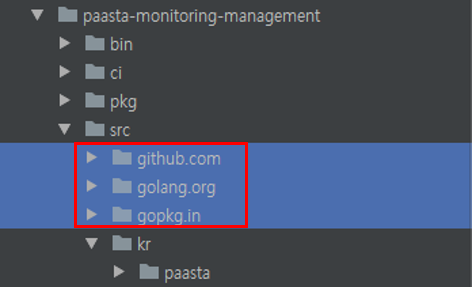
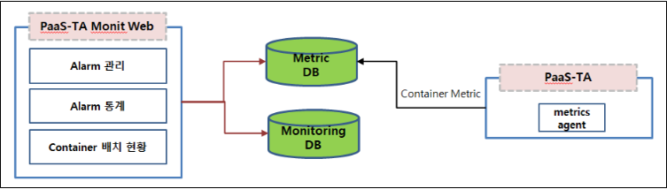
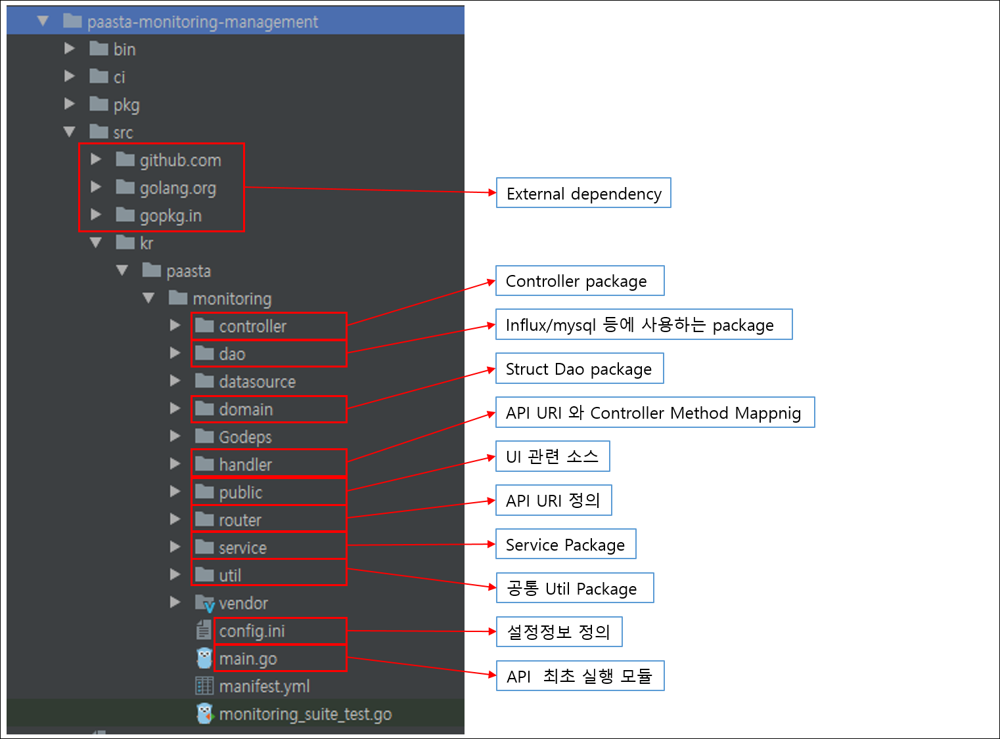
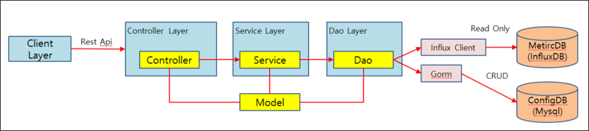
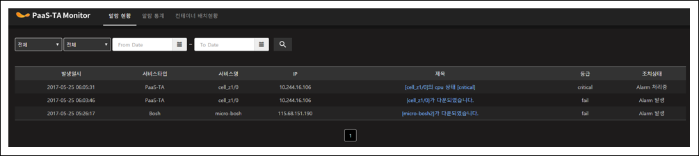
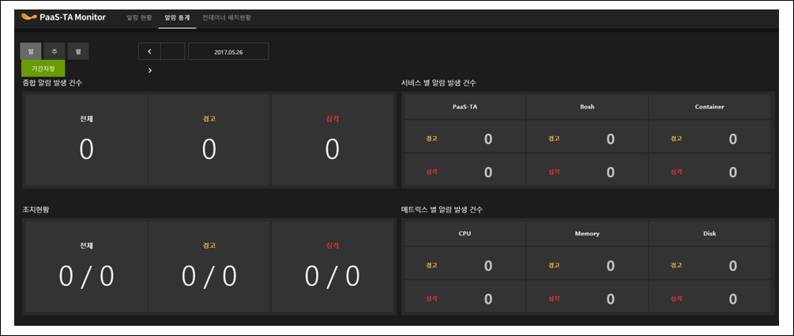
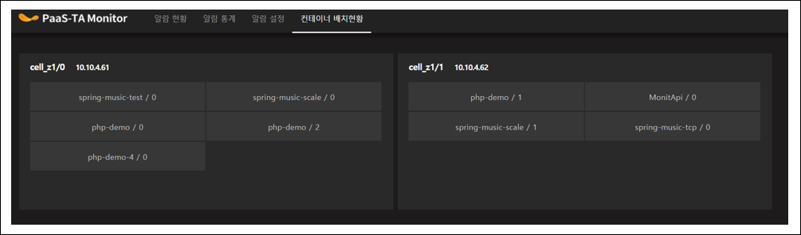

PaaS-TA-Monitoring-2.0_Management
=================================

#### 이어서

  

1. [개요](#0)
2. [PaaS-TA-Monitoring 애플리케이션 환결설정](#0)
    * [애플리케이션 프로젝트 Open](#0)    
        * [Dependencies Module Download](#1)
        * [Paasta-monitoring-management Dependency Download](#2)
3. [PaaS-TA 모니터링 애플리케이션 구성](#3)  
    * [PaaS-TA 모니터링 Web](#4)
        * [PaaS-TA Monitoring-Web Component](#5)
        * [PaaS-TA Monitoring-Web 설정정보](#6)
        * [PaaS-TA Monitoring-Web Package 구조](#7)
        * [PaaS-TA Monitoring-API Package간 호출 구조](#8)
        * [PaaS-TA Monitoring-Web 화면](#9)
            * [알람 현황 정보](#10)
            * [알람 통계](#11)
            * [Container 배치 현황 정보](#12)
        * [PaaS-TA 모니터링Web 실행](#13)
            * [Linux](#14)
            * [Wndows](#15)
        * [PaaS-TA 모니터링 Web PaaS-TA 배포](#16)
            * [Manifest.yml](#17)
            * [PaaS-TA 배포](#18)

        
  

###  2.4.2. Dependencies Module Download 

#### 2.4.2.2. Paasta-monitoring-management Dependency Download 

> Dos 창을 오픈한다.

    $ cd \PaaS-TA-Monitoring\paasta-monitoring-batch
    $ set GOPATH='현재 디렉토리 경로"
    $ set PATH=%PATH%;%GOPATH%bin;

입력창에 아래와 같이 입력한다.

    go get github.com/tedsuo/ifrit
    go get github.com/tedsuo/rata
    go get github.com/go-sql-driver/mysql
    go get github.com/jinzhu/gorm
    go get github.com/influxdata/influxdb/client/v2
    go get github.com/gorilla/handlers
    go get github.com/gorilla/mux
    go get github.com/stretchr/testify/assert
    go get github.com/onsi/ginkgo
    go get github.com/onsi/gomega
    go get github.com/tools/godep
    go get golang.org/x/sys/unix
    go get github.com/davecgh/go-spew/spew
    go get github.com/pmezard/go-difflib/difflib

src 디렉토리에 Dependencies 소스들이 다운로드 되어 있음을 확인한다.

  

# 3. PaaS-TA 모니터링 애플리케이션 구성 

> PaaS-TA 모니터링 Application은 Monitoring Batch/Management로 구성되어 있다. Batch는 PaaS-TA Component 감시역할을 하며 Alarm정책에 위배 되었을 때 Alarm을 발생한다. Management는 Alarm Web App으로 컨테이너 배치현황, 알람통계, 알람 정보등을 사용자에게 제공한다. Monitoring Batch는 Table schema 및 기초Data를 생성하는 역할을 하기 떄문에 Monitoring-Batch가 실행 된 후 Monitoring-Management가 실행되어야 한다.

그림 1. PaaS-TA Monitoring 구성도

 

<table>
    <tr>
        <th>프로젝트</th>
        <th>기능</th>
    </tr>
    <tr>
        <td>pasta-monitoring-Management</td>
        <td>
            Alarm 관리  
            Alarm 통계  
            컨테이너 배치
        </td>
    </tr>
</table>

 

##   3.2. PaaS-TA 모니터링 Web 

> PaaS-TA Monitoring API는 Batch에서 발생한 Alarm조회 및 관리/통계 정보를 제공한다. MetricDB를 조회하여 Container 배치 현황을 조회한다

 

###  3.2.1.	PaaS-TA Monitoring-Web Component 

<table>
    <tr>
        <th>Component</th>
        <th>설명</th>
    </tr>
    <tr>
        <td>Alarm 관리</td>
        <td>알람현황 조회 및 조치 이력을 관리한다.</td>
    </tr>
    <tr>
        <td>Alarm 통계</td>
        <td>알람이 발생한 통계정보를 일/주/월 별로 조회한다.</td>
    </tr>
    <tr>
        <td>Container 배치</td>
        <td>Application이 배포된 Cell들의 Container 배치 현황을 조회한다.</td>
    </tr>
</table>

 

###  3.2.2.	PaaS-TA Monitoring-Web 설정정보 

> Monitoring-Web는 Config.ini에 관련 속성정보를 정의 한다.

    server.url = http://monitapi.xx.xxx.xxx.xxx.xip.io   Monitoring Web Url
    
    server.port = 8080   Server Port
    
    #MonitoringDB 접속 정보
    #Monitoring Batch가 먼저 실행되어야 함.
    monitoring.db.type=mysql
    monitoring.db.dbname=PaastaMonitoring
    monitoring.db.username=xxx
    monitoring.db.password=xxxx
    monitoring.db.host=xxx.xxx.xxx.xxx
    monitoring.db.port=xxx
    
    #MetricDB(InfluxDB) 접속정보
    metric.db.username =
    metric.db.password =
    metric.db.url = http://xxx.xxx.xxx.xxx::8086
    
    metric.controller.db_name=cf_metric_db
    metric.infra.db_name=bosh_metric_db
    metric.container.db_name=container_metric_db
    
    gmt.time.hour.gap=9  

 

###  3.2.3.	PaaS-TA Monitoring-Web Package 구조 

 

###  3.2.4.	PaaS-TA Monitoring-API Package간 호출 구조 

 

 
###  3.2.5.	PaaS-TA Monitoring-Web 화면 

#### 3.2.5.1. 알람 현황 정보 

> 알람 현황정보는 Batch에서 발생한 Alarm정보를 조회 및 조치 완료 처리를 할 수 있다.

 
 

#### 3.2.5.2. 알람 통계 

> 특정 기간동안 발생한 Alarm 통계정보를 조회 할 수 있다.

 
 

#### 3.2.5.3. Container 배치 현황 정보 

> Container가 어떤 Cell에 배포 되었는지 조회 할 수 있다.

  

###  3.2.6.	PaaS-TA 모니터링Web 실행 

#### 3.2.6.1. Linux 

> Linux 경에서는 다음과 같은 방식으로 실행 한다.

    $ cd PaaS-TA-Monitoring/pasta-monitoring-management
    $ ./run.sh

⇒ 실행전 install_batch.sh 를 먼저 실행되어야 한다.(Dependency Download)

 

####  3.2.6.2. Wndows 

> Windows 환경에서는 다음과 같은 방식으로 실행 한다.

⇒ 실행전 install_management.sh 를 먼저 실행되어야 한다.(Dependency Download)

    $ cd PaaS-TA-Monitoring/pasta-monitoring-management
    $ set GOPATH=”현재 디렉토리 경로”
    $ set PATH=%PATH%;%GOPATH%bin;
    $ cd src/kr/paasta/monitoring
    $ go run main.go
    
⇒ Localhot:8080 으로 접속하여 화면 확인 가능

 

###  3.2.7.	PaaS-TA 모니터링 Web PaaS-TA 배포 

> Monitoring-web는 자체적으로 실행 될 수 있지만 PaaS-TA에 App으로 배포 할 수 있다.

 

#### 3.2.7.1. Manifest.yml 

> PaaS-TA-Monitoring/Pasta-monitoring-management/src/kr/monitoring 디렉토리 이하에 manifest.yml 파일이 존재한다.

    applications:
    - name: MonitApi     Application 명
      memory: 256M       할당 메모리
      instances: 1       인스턴스 수(1개 이어야 함)
    buildpack: go_buildpack

 

#### 3.2.7.2. PaaS-TA 배포 

> Prerequsit : cf cli가 설치 되어 있어야 하며,  cf cli가 PaaS-TA 에 로그인 되어 있어야 한다.

    $ cd PaaS-TA-Monitoring/Pasta-monitoring-management/src/kr/monitoring
    $ cf push –f ./manifest.yml
